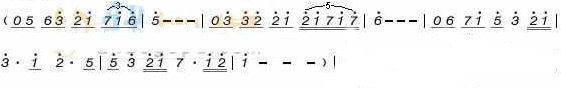
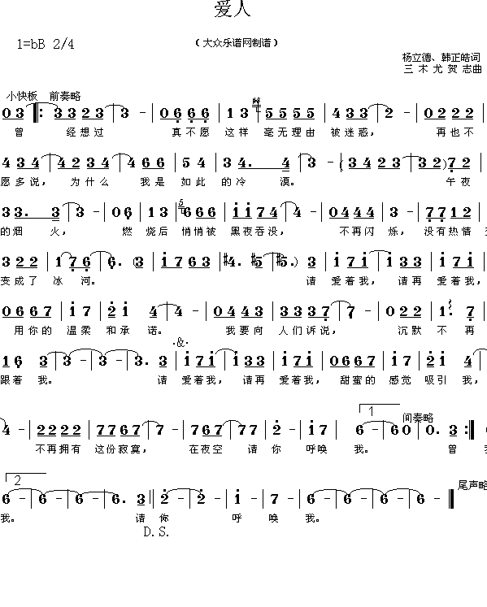
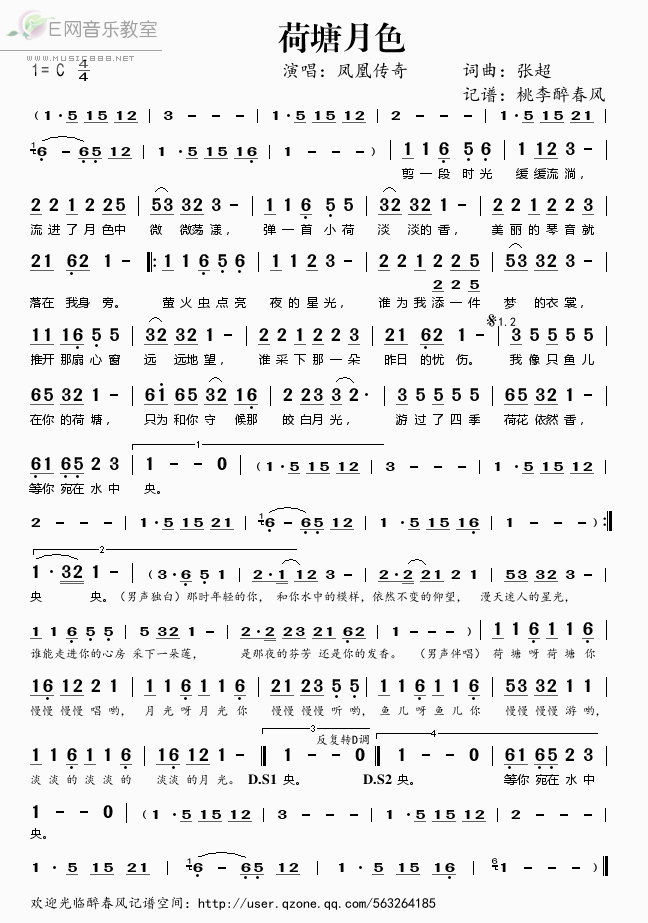
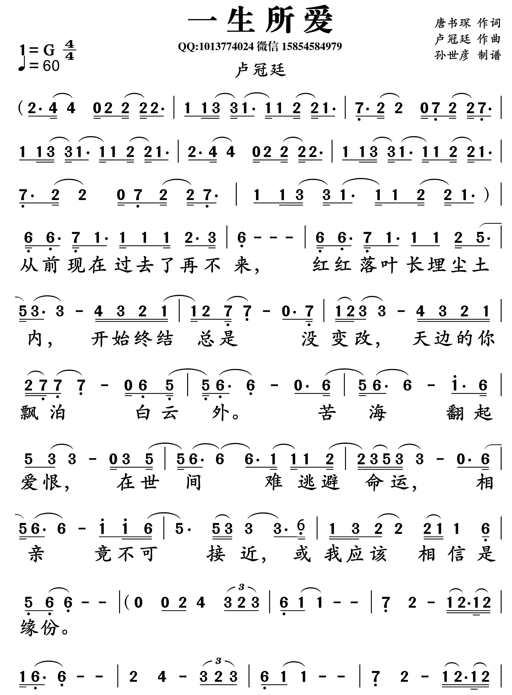

---
output:
  pdf_document: default
  html_document: default
---

# Chinese Songs


\newpage

## 千言万语(邓丽君)

Key: G, Capo: 2

```
G            Bm   Em            Bm
_不知道为了什么,  _ 忧愁它围绕著我
C             F  C      D     G
_我每天都在祈祷, _快赶走爱的寂寞
    Em        Em  Am   A   D
那天起, 你对我说, 永远地爱著我
  G     Bm    Am  A    D
千言和万语, 随浮  云 掠过
```

Key: C, Capo: 4  

~~

```
[拨弦分解]
C　不知道为了什Em么-　Am　憂愁他圍繞著Em我-
C　我每天都在Dm祈禱-　G　快趕走愛的寂C寞
[渐强,组合和弦]
那天Am起　你對我Am说-　永Dm遠的G7愛著C我-
千Em言和萬Am語　隨浮Dm雲掠G7過

C　不知道为了什Em么-　Am　憂愁他圍繞著Em我-
C　我每天都在Dm祈禱-　G　快趕走愛的寂C寞
那天Am起　你對我Am说-　永Dm遠的G7愛著C我-
千Em言和萬Am語　隨浮Dm雲掠G7過

[拨弦分解]
C　不知道为了什Em么-　Am　憂愁他圍繞著Em我-
C　我每天都在Dm祈禱-　G　快趕走愛的寂C寞
```

Capo 5:  
<iframe width="560" height="315" src="https://www.youtube.com/embed/g0ph7fHDH3s" frameborder="0" allow="autoplay; encrypted-media" allowfullscreen></iframe>

<iframe width="560" height="315" src="https://www.youtube.com/embed/8UX-gyIdPQY" frameborder="0" allow="autoplay; encrypted-media" allowfullscreen></iframe>

<iframe width="560" height="315" src="https://www.youtube.com/embed/Mgo8JgCneFY" frameborder="0" allow="autoplay; encrypted-media" allowfullscreen></iframe>


## 月亮代表我的心(邓丽君)

```
你C问我爱你Em7有多深
我F爱你有几C分
我的Am情也真
我的F爱也真
月亮Dm代表我的G7心

你C问我爱你Em7有多深
我F爱你有几C分
我的Am情不移
我的F爱不变
月亮Dm代表G7我的C心

轻轻的一个Em7吻
已经F打动G7我的C心
深深的一段Em7情
教我F思念Dm到如G7今

你C问我爱你Em7有多深
我F爱你有几C分
你去Am想一想
你去F看一看
月亮Dm代表G7我的C心
```


Capo 1:  
<iframe width="560" height="315" src="https://www.youtube.com/embed/ltfOJI0zlzM" frameborder="0" allow="autoplay; encrypted-media" allowfullscreen></iframe>

Capo 7 for MP3 version(verify):

<iframe width="560" height="315" src="https://www.youtube.com/embed/WCYXsQhnjyw" frameborder="0" allow="autoplay; encrypted-media" allowfullscreen></iframe>


\newpage

## 在水一方(邓丽君)


```
编排: Henry Wu
C 4/4  capo 5th 扫弦或分解和弦皆可

  C   Am  Dm  G
绿草苍苍  白雾茫茫
绿草萋萋  白雾迷离
  F   Em  Dm  C
有位佳人  在水一方
有位佳人  靠水而居
Am      Em    F   Am  Dm  (扫G)
我愿逆流而上  依偎在她身旁
我愿逆流而上  与她轻言细语
C   Em   Dm   F   Am   G
无奈前有险滩  道路又远又长
无奈前有险滩  道路曲折无已
Am      Em    F   Am  Dm  (扫G)
我愿顺流而下  找寻她的方向
我愿顺流而下  找寻她的踪迹
C   Em   Dm   F   G   C
却见依稀仿佛  她在水的中央
却见仿佛依稀  她在水中伫立
End:
  C   Am  Dm  G
绿草苍苍  白雾茫茫
  F   Em  Dm  C
有位佳人  在水一方
```

<iframe width="560" height="315" src="https://www.youtube.com/embed/M2ps0kWNSFY" frameborder="0" allow="autoplay; encrypted-media" allowfullscreen></iframe>

Capo 0


\newpage

## 又见炊烟(邓丽君)

```
C 4/4  capo 5th 扫弦或分解和弦皆可
C   Am  F C   F   G   C
又见炊烟升起,暮色罩大地
又见炊烟升起,勾起我回忆
C   Am  F C      G   C
想问阵阵炊烟,你要去哪里
愿你变作彩霞,飞到我梦里
Dm  C       F   C   G
夕阳有诗情,黄昏有画意
夕阳有诗情,黄昏有画意
F   Em  Dm   C       F  G   C
诗情画意虽然美丽,我心中只有你
诗情画意虽然美丽,我心中只有你
```

<iframe width="560" height="315" src="https://www.youtube.com/embed/zqg7Khc9E-Y" frameborder="0" allow="autoplay; encrypted-media" allowfullscreen></iframe>


\newpage

## 我只在乎你(邓丽君)

Capo: 0 or 2

```
C           G  Am          Em
如果没有遇见你 我将会是在哪里
F           C  F           G
日子过得怎么样 人生是否要珍惜
C           G  Am          Em
也许认识某一人 过着平凡的日子
F         C  Am          G
不知道会不会 也有爱情甜如蜜
      C                Am
任时光匆匆流去 我只在乎你
    C             Am 
心甘情愿感染你的气息
    F        E     Am  
人生几何 能够得到知己
    Dm              G  E
失去生命的力量也不可惜
    Am    C    Am      F
所以我求求你 别让我离开你
C      Am        F   G   C
除了你 我不能感到一丝丝情意
```

<iframe width="560" height="315" src="https://www.youtube.com/embed/uS9g9_f63T4" frameborder="0" allow="autoplay; encrypted-media" allowfullscreen></iframe>

Capo 5


\newpage

## 何日君再来(邓丽君)

```
C好花不常Am开,C好景Am不常G在.
C愁堆解笑G眉,C泪洒Am相思G带.
C今宵Am离别G后,C何日君再Am来？
F喝完了C这杯,F请进点G小菜.
C人生难得Am几回G醉,C不欢更何G待？

==来来来,喝完这杯再说吧==

C今宵离别G后,F何日G君再C来？
C停唱阳关Am叠,C重擎Am白玉G杯.
C殷勤频致G语,C牢牢Am抚君G怀.
C今宵Am离别G后,C何日君再Am来？
F喝完了C这杯,F请进点G小菜.
C人生难得Am几回G醉,C不欢更何G待？

==唉,再喝一杯,干了吧.==

C今宵离别G后,F何日G君再C来？
```
Capo 7:  
<iframe width="560" height="315" src="https://www.youtube.com/embed/YWQ72Xy69DQ" frameborder="0" allow="autoplay; encrypted-media" allowfullscreen></iframe>

<iframe width="560" height="315" src="https://www.youtube.com/embed/Z8eQFCwURbI" frameborder="0" allow="autoplay; encrypted-media" allowfullscreen></iframe>

<iframe width="560" height="315" src="https://www.youtube.com/embed/x_TPeRKh1fU" frameborder="0" allow="autoplay; encrypted-media" allowfullscreen></iframe>


\newpage

## 甜蜜蜜(邓丽君)

```
D甜蜜D蜜  你Em7笑得A甜蜜D蜜
Em7好象花儿A开在春风D里 开Em7在春风A里
D在哪D里 在Em7哪里A见过D你
Em7你的笑容A这样熟D悉 我Em7一时A想不D起
D啊 A在梦D里
Bm梦里 Bm梦里见过D你 Bm甜蜜 Bm笑得多甜D蜜
是A你 是A你 梦A见的就是A你
D在哪D里 在Em7哪里A见过D你
Em7你的笑容A这样熟D悉 我Em7一时A想不D起
D啊 A在梦D里
```

Capo 2:  
<iframe width="560" height="315" src="https://www.youtube.com/embed/n78Rq-MN9cA" frameborder="0" allow="autoplay; encrypted-media" allowfullscreen></iframe>


\newpage


## 漫步人生路(邓丽君)

Capo: 5

```
Am在你身边路虽Em远未疲倦
伴F你漫行一段C接一E段
Am越过高峰另一Em峰却又见
目F标推远G让理想Em永远在前Am面
Am路纵崎岖亦不Em怕受磨练
愿F一生中苦痛快乐C也体E验
Am愉快悲哀在身Em边转又转
风F中赏雪G雾里赏花Em快乐回Am旋
毋用F计较  快欣赏身边Am美丽每一天
还愿F确信美景良辰E在脚Esus4边

副歌A
愿Am将欢笑声盖掩C苦痛那一面
悲也Dm好喜也好  每天E找到新发现
让疾Am风吹呀吹  尽管C给我俩考验
小雨Dm点放心E洒  早已Em决心向着Am前

间奏
Am路纵崎岖亦不Em怕受磨练
愿F一生中苦痛快乐C也体E验
Am愉快悲哀在身Em边转又转
风F中赏雪G雾里赏花Em快乐回Am旋
毋用F计较  快欣赏身边Am美丽每一天
还愿F确信美景良辰E在脚Esus4边

副歌B
愿Am将欢笑声盖掩C苦痛那一面
悲也Dm好喜也好  每天E找到新发现
让疾Am风吹呀吹  尽管C给我俩考验
小雨Dm点放心E洒  早已Em决心向着Am前
```

<iframe width="560" height="315" src="https://www.youtube.com/embed/lK-m-etVWkw" frameborder="0" allow="autoplay; encrypted-media" allowfullscreen></iframe>

Capo 0


\newpage


## 但愿人长久(邓丽君)

Capo: 5
```
C明月几时Am有   F把酒问青G天
Am不知天上Dm宫阙   F今夕是何年G  
C我欲乘风归Am去   F唯恐琼楼玉G宇  
Am高处不胜Dm寒   F起舞弄清影G  
Dm何似在人C间
C转朱阁  F低绮户  Dm照  无G眠
C不应有恨  F何事长向 Dm别 时G圆
C人有悲欢离Am合  F月有阴晴圆G缺
Am此事古难Dm全  F但愿人长G久  Dm千里共婵C娟
```

<iframe width="560" height="315" src="https://www.youtube.com/embed/ZRW9g5gA75I" frameborder="0" allow="autoplay; encrypted-media" allowfullscreen></iframe>


\newpage


## 再见我的爱人(邓丽君)

```
★GOODBYE MY C LOVE 我的Am爱人 再G见
★GOODBYE MY C LOVE 相见Am不知那一Em天
★我把F一切给了Em你 希望Dm你要Am珍惜   Dm不要辜负F我的真G情意 
★GOODBYE MY C LOVE 我的Am爱人 再G见
★GOODBYE MY C LOVE 从此Am和你分Em离
★我会F永远永Em远       爱Dm你在Am心里    Dm希望你F不要把我忘C记
★我永远C怀念你 温柔的Em情怀念里
★永恒的Am心怀念你 甜蜜的Dm吻怀G念你
★那F醉人的G歌声 怎F能忘记这G段情 我的C爱再Am见  Dm不知G那日再C相见
★我的C爱我Am相信 Dm总有一天G能再C见
```

<iframe width="560" height="315" src="https://www.youtube.com/embed/cRzXzqSJ0ZU" frameborder="0" allow="autoplay; encrypted-media" allowfullscreen></iframe>

<iframe width="560" height="315" src="https://www.youtube.com/embed/xtAA1LOIKP0" frameborder="0" allow="autoplay; encrypted-media" allowfullscreen></iframe>

<iframe width="560" height="315" src="https://www.youtube.com/embed/CccGhiXnIRQ" frameborder="0" allow="autoplay; encrypted-media" allowfullscreen></iframe>


[2](https://img6.zhaogepu.com/img/124072/jianpu/62031_1.jpg)

\newpage


## 偿还(邓丽君)

Capo: 4, 用大拇指扫玄
```
 a段
    沉默的Am嘴唇     还留着泪Dm痕
    这不是胭E7脂红粉   可掩饰的C伤痕E7  
    破碎的Am心灵     流失了Dm多少的情
    弥补的谎C言      偿还的借E7口
    我不会去Am当真
    爱的心Dm路旅程    G只能够你我C两个人
    E7不可能是我Dm独徘徊    G也不可能三人C行
    E7你可以去找新的Dm恋情    E7也可以不留一点Am音讯
    但不要用偿还Dm做借口    E7再让我伤心Am
b段
    爱哭的Am眼睛    让泪水染Dm红
    要多少岁E7月时光    才遗忘这C一段情
    E7脆弱的Am心情    还留着你Dm的伤痕
    弥补的谎C言    偿还的借E7口
    我怎么能Am相信
副歌B
    爱的心Dm路旅程  G我曾经答应C你牵引
    E7这只能说我Dm太多情   G不敢埋怨你无C  情
    E7我曾经耐心听你Dm表明 E7也已经谅解你的Am苦衷
    请不要用偿还做Dm借口   E7伤了我自尊Am  

结尾
    爱的心Dm路旅程    G只能够你我C两个人
    E7不可能是我Dm独徘徊    G也不可能三人C行
    E7你可以去找新的Dm恋情  E7也可以不留一点Am音讯
    但不要用偿还Dm做借口    E7再让我伤心Am  
```

<iframe width="560" height="315" src="https://www.youtube.com/embed/oU9FlS9m170" frameborder="0" allow="autoplay; encrypted-media" allowfullscreen></iframe>

<iframe width="560" height="315" src="https://www.youtube.com/embed/YIfLIL5A9Z0" frameborder="0" allow="autoplay; encrypted-media" allowfullscreen></iframe>


http://www.jianpuw.com/htm/bw/364078.htm

\newpage

## 船歌(邓丽君)

Capo: 4
```
主歌 A
C喂～
F风儿呀G吹动我的C船帆
Dm船儿呀G随风荡Am漾
Dm送我到G日夜思念的C地方

C喂～
F风儿呀G吹动我的C船帆
Dm姑娘呀G我要和你见Am面
Dm诉一诉G心里对你的C思念

副歌
C当我还G没来到F你的面Am前
C你千万要G把我要F记在心Am间
要C等待着G我呀
要F耐心等着我G呀

G姑娘～
我的心像那黎明的温暖太阳G  

主歌 B
C喂～
F风儿呀G吹动我的C船帆
Dm船儿呀G随风荡Am漾
Dm送我到G日夜思念的C地方
C喂～
F风儿呀G吹动我的C船帆
Dm姑娘呀G我要和你见Am面
Dm诉一诉G心里对你的C思念 C喂～
```

\newpage

## 愛人(邓丽君)

<iframe width="560" height="315" src="https://www.youtube.com/embed/mT5zZZ3OD84" frameborder="0" allow="autoplay; encrypted-media" allowfullscreen></iframe>

<iframe width="560" height="315" src="https://www.youtube.com/embed/ub219zaOoUw" frameborder="0" allow="autoplay; encrypted-media" allowfullscreen></iframe>




\newpage

## 娘心(邓丽君)

Capo 8:  

<iframe width="560" height="315" src="https://www.youtube.com/embed/jPuJtQ3Sko4" frameborder="0" allow="autoplay; encrypted-media" allowfullscreen></iframe>


这首歌适合木吉他演奏. 可以用两个八度. 加上低八度,最多三个,不过难度较大.


\newpage

## 夜來香(邓丽君)

<iframe width="560" height="315" src="https://www.youtube.com/embed/5C6D4i9ZuTs" frameborder="0" allow="autoplay; encrypted-media" allowfullscreen></iframe>


\newpage

## 小城故事(邓丽君)

Capo 0:  

<iframe width="560" height="315" src="https://www.youtube.com/embed/Os-p9qES--g" frameborder="0" allow="autoplay; encrypted-media" allowfullscreen></iframe>


\newpage

## 君心我心(邓丽君)

Capo 0  
<iframe width="560" height="315" src="https://www.youtube.com/embed/3lV3WpBBHcI" frameborder="0" allow="autoplay; encrypted-media" allowfullscreen></iframe>


\newpage

## 你怎么说(邓丽君)

```
C我没忘记C你忘记我
C连名字你都说C错
C　证明你Am一切都是F在骗G我
G　看今天G你怎么C说

C你说过两天C来看G我
C一等就是Am一年G多
三百C六十五个C日子不好Am过
Dm你心里根本没有G我
G　把我的G爱情还给C我
```

Capo 5:  
<iframe width="560" height="315" src="https://www.youtube.com/embed/B1qsjCE7VTo" frameborder="0" allow="autoplay; encrypted-media" allowfullscreen></iframe>

<iframe width="560" height="315" src="https://www.youtube.com/embed/q96MurOE7ow" frameborder="0" allow="autoplay; encrypted-media" allowfullscreen></iframe>

<iframe width="560" height="315" src="https://www.youtube.com/embed/5SWtCQPc4QM" frameborder="0" allow="autoplay; encrypted-media" allowfullscreen></iframe>


\newpage


## 女儿情

Capo: 3 or 5

```

|5 5 5 6 1_ 1_ 23_ 5| 5 5 5 6 1_ 1_ 23_ 56|
|12__ 6_ 1__ 5_| 6_ 1__ 56_ 56_ 3_| 5_ 5_ 5_ 2_ 3_ 56 1_|

C Em, C Am, C Em C Am G Am C

鸳鸯C双栖G蝶双Am飞   3 12 56
满园Em春色C惹人C醉   45 23
悄悄Am问圣僧女儿Dm美不美女Em儿美不C美

C说什么王权富Am贵 C怕什么戒律清Em规
只愿C天长G地Am久 与我C意中Am人儿紧相Em随

爱Am恋伊爱Dm恋伊 
愿G今生Em长相C随
```

<iframe width="560" height="315" src="https://www.youtube.com/embed/_JQrjFXbYP8" frameborder="0" allow="autoplay; encrypted-media" allowfullscreen></iframe>

Capo 3


http://www.17jita.com/tab/img/6459.html

  


\newpage


## 真的好想你

Capo 3

```
C       Am
真的好想你
G           Em
我在夜裏呼喚黎明
AM         C F         C  Dm            G
追月的彩雲喲也知道我的心  默默地爲我送溫馨
                          Dm     G   C
天上的星星喲也瞭解我的心  我心中只有你

    Am  C   F   C   Dm        G
千山萬水怎麼能隔阻, 我對 你 的愛
你的笑容就像一首歌, 滋潤着我的愛
    Am  C   F   C   Dm      G
月亮下面輕輕的飄着  我的一片情
你的身影就象一條河  滋潤着我的情

C       Am
真的好想你
G           Em
你是我生命的黎明
AM         C F         C
寒冷的冬天喲也早已過去
Dm     G     C
但願我留在你的心
```

http://chord4.com/tabs/7765

Capo 7:  
<iframe width="560" height="315" src="https://www.youtube.com/embed/jaRMCkIVwiM" frameborder="0" allow="autoplay; encrypted-media" allowfullscreen></iframe>

http://www.17jita.com/tab/img/6052.html


可以弹低音和高音两次


\newpage

## 鸿雁

```
G鸿  D雁     G天空Em上     C对对G排成D行  H 1 0-2
G江水C长 Em秋草Bm黄        G草原上Bm琴声忧Em伤
G鸿  D雁  G向南Em方        C飞G过芦苇D荡  H 1 0-2
G天苍C茫 Em雁何Bm往        G心中是Bm北方家Em乡
G天苍C茫 Em雁何Bm往        G心中是Bm北方家Em乡
G Em G Bm Em Bm Em D
副歌
G鸿  D雁     G北归Em还       C带上我G的思D念
G歌声C远    Em琴声Bm颤       G草原Bm上春意Em暖
G鸿  D雁     G向苍Em天       C天空有G多遥D远
G酒喝D干    Em再斟Bm满       G今夜Bm不醉不Em还
G酒喝C干    Em再斟Bm满       G今夜Bm不醉不Em还
```

Capo 7:  
<iframe width="560" height="315" src="https://www.youtube.com/embed/9wWuo6sc1SM" frameborder="0" allow="autoplay; encrypted-media" allowfullscreen></iframe>

<iframe width="560" height="315" src="https://www.youtube.com/embed/hC68qhgJ_kU" frameborder="0" allow="autoplay; encrypted-media" allowfullscreen></iframe>

<iframe width="560" height="315" src="https://www.youtube.com/embed/yGPVBRATSeA" frameborder="0" allow="autoplay; encrypted-media" allowfullscreen></iframe>


\newpage

## 女人花

```
C           Em          Am          G
我有花一朵,长在我心中,含苞待放意幽幽.
我有花一朵,花香满枝头,谁来真心寻芳踪.
我有花一朵,长在我心中,真情真爱无人懂.
爱过知情重, 醉过知酒浓, 花开花谢总是空.
 F           C    Am     G          C
朝朝与暮暮啊切切地等候, 有心的人来入梦.
花开不多时啊堪折直须折, 女人如花花似梦.
遍地的野草已占满了山坡, 孤芳自赏最心痛.
缘份不停留像春风来又走, 女人如花花似梦(End)
     C             Em       F             C
女人/花,摇曳在红尘/中；女人/花,随风轻轻摆/动.
     C          Am     F          G  
只盼望有一双温柔手,能抚慰我内心的寂寞
若是你闻过了花香涌,别问我花儿是为谁红.
```

Capo 5:  
<iframe width="560" height="315" src="https://www.youtube.com/embed/m4cQgjGjqPA" frameborder="0" allow="autoplay; encrypted-media" allowfullscreen></iframe>

Capo 3:  
<iframe width="560" height="315" src="https://www.youtube.com/embed/E12MxOX88P0" frameborder="0" allow="autoplay; encrypted-media" allowfullscreen></iframe>

Capo 3:  
<iframe width="560" height="315" src="https://www.youtube.com/embed/0rPdLfxOOv4" frameborder="0" allow="autoplay; encrypted-media" allowfullscreen></iframe>


\newpage


## 为爱痴狂(刘若英)

```
    G      Bm            C         D
    我从春天走来     你在秋天说要分开
  Em            Am   D           D7
  __说好不为你忧伤   但心情怎会无恙
    G         Bm         C         D
    为何总是这样     在我心中深藏著你
    C           Am       D7       G
    想要问你想不想   陪我到地老天荒

    Am(Bm#)  Bm(Cm#)   C(D)      D(E#)
*   如果爱情这样忧伤  为何不让我分享
    Bm(Cm#)  Em(Fm#)   C(D)      D(E#)
    日夜都问你也不回答  怎么你会变这样

        Am(Bm)   D(E#)    Bm(Cm#)       Em(Fm#)
    想要问问你敢不敢  像你说过那样的爱我
        Am(Bm)   D(E#)    C(D)          D(E#)
    想要问问你敢不敢  像我这样为爱痴狂
        Am(Bm)   D(E#)    Bm(Cm#)       Em(Fm#)
**  想要问问你敢不敢  像你说过那样的爱我
        Am(Bm)   D(E#)    Am(Bm)  D(E#) G(A)
    像我这样为爱痴狂  到底你会怎么想

    G(A)      Bm(Cm#)  C(D)       D(E#)
    为何总是这样     在我心中深藏著你
    Em(Fm#)   Am(Bm)   D7(E#)     G(A)
    说好不为你忧伤   但心情怎会无恙
```

<iframe width="560" height="315" src="https://www.youtube.com/embed/ElzgPuK6ang" frameborder="0" allow="autoplay; encrypted-media" allowfullscreen></iframe>

<iframe width="560" height="315" src="https://www.youtube.com/embed/hkOhUQN3HWE" frameborder="0" allow="autoplay; encrypted-media" allowfullscreen></iframe>

(Capo 8)


\newpage


## 恰似你的温柔

```
C某年某月的某一Am天 F就像一张破碎的G7脸
难以C开口道再Am见 就F让一切走G7远
C这不是件容易的Am事 F我们却都没有哭G7泣
让C它淡淡的Am来 让F它好好的G7去

副歌

到如今C年复一年 我不能Am停止怀念
怀念F你怀念从G7前
但愿那C海风再起 只为那Am浪花的手
恰F似你G7的温C柔
```

Capo 10 最后一个A到C3的音用**食指**滑弦.

<iframe width="560" height="315" src="https://www.youtube.com/embed/oRpdbhcNHII" frameborder="0" allow="autoplay; encrypted-media" allowfullscreen></iframe>

Capo 5

<iframe width="560" height="315" src="https://www.youtube.com/embed/Kt49y1jRYMI" frameborder="0" allow="autoplay; encrypted-media" allowfullscreen></iframe>


\newpage

## 外面的世界(齐秦)

```
前奏
G D Em G D Em C D G Bm7 Em C D7 G

G_在很久D(很)久以Em(前)
你拥有我C_D_我拥有你G_
G_在很久D(很)久以Em(前)
你离开我C_去D7远空翱翔G_G_

副歌
C_外面的世D_界很精G(彩)
C_外面的世D_界很无奈G_
C_当你觉得D(外)面的世界G(很)Bm7(精)Em(彩)
我Am(会)在这里A7(衷)心的祝福你D7sus4_D7_

结尾
G_每当夕阳D西沉的时候Em_
我总C(是)在D(这)里盼望你G_
G_天空中D(虽)然飘着雨Em_
我依C(然)等待D7(你)的归期G_
```


Capo 7:  
<iframe width="560" height="315" src="https://www.youtube.com/embed/2XAJDAuihiA" frameborder="0" allow="autoplay; encrypted-media" allowfullscreen></iframe>


\newpage


## 菊花台

```
主歌 A
C你的泪光      Am柔弱中带伤             F惨白的月弯弯    G勾住过往 
C夜太漫长      Am凝结成了霜             F是谁在阁楼上    冰G冷地绝望 
C雨轻轻弹      Am朱红色的窗             F我一生在纸上    G被风吹乱 
C梦在远方      Am化成一缕香             随F风飘G散       你的C模样 

副歌
菊花C残       满地Am伤                  你的F笑容已泛G黄 
Am花落人断肠      我心G事静静躺 
北风C乱       夜未Am央                  你的Am影子剪不F断 
C徒留我Am孤单    在湖F面  G成  C双 

主歌B
C花已向晚       Am飘落了灿烂            F凋谢的世道上      G命运不堪 
C愁莫渡江        Am秋心拆两半           C怕你上不了岸    一G辈子摇晃 
C谁的江山        Am马蹄声狂乱           F我一身的戎装      G呼啸沧桑 
C天微微亮         Am你轻声地叹          一F夜惆G怅       如C此委婉 
```

<iframe width="560" height="315" src="https://www.youtube.com/embed/TCuXXSXOnVw" frameborder="0" allow="autoplay; encrypted-media" allowfullscreen></iframe>

Capo 5:  
<iframe width="560" height="315" src="https://www.youtube.com/embed/PtHTJymHkC8" frameborder="0" allow="autoplay; encrypted-media" allowfullscreen></iframe>


\newpage

## 荷塘月色(凤凰传奇)

```
C剪一段时光Am7缓缓流淌
Dm流进了G月色中C微微荡漾
C弹一首小荷Am7淡淡的香
Dm美丽的琴音就G落在我身旁C

C萤火虫点亮Am7夜的星光
G谁为我添一件C梦的衣裳
C推开那扇心窗Am7远远地望
G谁采下那一朵C昨日的忧伤

C我像只鱼儿Am在你的荷塘
F只为和你守候那G皎白月光
C游过了四季 Am荷花依然香
Dm等你宛在G水中C央 

recite
那时年轻的你 和你水中的模样 
依然不变的仰望 漫天迷人的星光 
谁能走进你的心房 采下一朵莲
是那夜的芬芳 还是你的发香 

C荷塘呀荷塘 你Am慢慢慢慢唱哟
F月光呀月光 你G慢慢慢慢听哟
C鱼儿呀鱼儿 你Am慢慢慢慢游哟
Dm淡淡的G淡淡的 C淡淡的月光
```

<iframe width="560" height="315" src="https://www.youtube.com/embed/AjRgCqY7awk" frameborder="0" allow="autoplay; encrypted-media" allowfullscreen></iframe>

Capo 0 but 8 octave higher:  



\newpage


## 友谊地久天长


Capo 7:  

<iframe width="560" height="315" src="https://www.youtube.com/embed/EyEdVjHCxu0" frameborder="0" allow="autoplay; encrypted-media" allowfullscreen></iframe>


\newpage


## 隱形的翅膀(張韶涵)

Capo: 3

```
    C          F       C
每一次 都在徘徊孤單中堅強
不去想 他們擁有美麗的太陽
    C    Em      Dm7     G         
每一次 就算很受傷也不閃泪光
我看見 每天的夕陽也會有變化
    Am7    Am7/G F       Am
我知道 我一直有雙隱形的翅膀
我知道 我一直有雙隱形的翅膀
    F    G7  C
帶我飛 飛過絕望
帶我飛 給我希望
Chorus:
    Am   G      F       C
我終於 看到 所有夢想都開花
    Dm7    Em7     G
追逐的年輕 歌聲多嘹亮
    Fmaj7 Em7   Dm7     C
我終於 翱翔 用心凝望不害怕
    Dm7    G       C
哪裏會有風 就飛多遠吧
Bridge:
    F   G      F       C
隱形的翅膀 讓夢恆久比天長
    F      G
留一個願望 讓自己想像
```

Capo 10:  
<iframe width="560" height="315" src="https://www.youtube.com/embed/3S1ojnfGYpc" frameborder="0" allow="autoplay; encrypted-media" allowfullscreen></iframe>

Capo 1:  
<iframe width="560" height="315" src="https://www.youtube.com/embed/oJVqReU5w28" frameborder="0" allow="autoplay; encrypted-media" allowfullscreen></iframe>


\newpage


## 铁血丹心

```
Am　依稀Am往梦Am似曾Am见 G　心G内波澜G现G　
Am　抛开Am世事Am断仇Am怨 F　相F伴到天E边E　
逐Am草四Am方沙漠G苍茫G　F那惧G雪霜扑C面
C　射Am雕引Am弓塞外G奔驰G　F笑傲G此生无厌Am倦 Am　
Am　应知Am爱意Am似流Am水 G　斩不G断理还G乱G　
Am　身经Am百劫也Em在心G间F　恩G义两难Am断 Am　
```

<iframe width="560" height="315" src="https://www.youtube.com/embed/CLRtu2_CHgU" frameborder="0" allow="autoplay; encrypted-media" allowfullscreen></iframe>


\newpage


## 存在(汪峰)

```
6/8 Ori: Capo 2; Me: 0
      C        Am
多少人(走)着却困在原地
多少次(荣)耀却感觉屈辱
      Dm        G
多少人(活)着却如同死去
多少次(狂)喜却倍受痛楚
      C        Am
多少人(爱)着却好似分离
多少次(幸)福却心如刀绞
      Dm       G
多少人(笑)着却满含泪滴
多少次(灿)烂却失魂落魄
      C        Am
谁知道(我)们该去向何处
谁知道(我)们该梦归何处
      F        G
谁明白(生)命已变为何物
谁明白(尊)严已沦为何物
    E         Am
是否找个借口继续苟活
是否找个理由随波逐流
    Dm        G 
或是展翅高飞保持愤怒
或是勇敢前行挣脱牢笼
       C
我该如何存在
```

\newpage


## 怒放的生命(汪峰)

Capo: 0
```
   Bm            D
曾经多少次跌倒在路上
曾经多少次失去了方向
    Em            Bm
曾经多少次折断过翅膀
曾经多少次扑灭了梦想
    Bm            D
如今我已不再感到彷徨
如今我已不再感到迷茫
    Em            A
我想超越这平凡的生活
我要我的生命得到解放
-------------------
       D     D
我想要怒放的生命
            Bm
就象飞翔在辽阔的天空
            Em
就象穿行在无边的旷野
    G           A
拥有挣脱一切的力量
-------------------
       D      D
我想要怒放的生命
            Bm
就象矗立在彩虹之颠
          Em
就象穿行璀璨的星河
    G           D
拥有超越平凡的力量
```
\newpage

## 飞得更高(汪峰)

Capo: 0
```
G生命就像 G  一条大河C, 时而宁静G  时而疯D狂
 现实就像 C   一把枷锁G, 把我捆住C  无法挣D脱
Em这谜样的生活锋利G如刀, Em一次次将我重伤G  
Em我知道我要的那种G幸福, 就在F那片更高的天D空
我要飞得更G高,飞得更Em高,Em狂风一样舞C蹈,C挣脱怀D抱
我要飞得更G高,飞得更Em高,Em翅膀卷起风C暴,C心生呼D啸
C飞得更高G

G一直在飞G一直在找C, 可我发现G, 无法找  D到
若真想要 C是一次解放G,要先剪碎C,这有过的D网
Em我要的一种生命更G灿烂,Em我要的一片天空更蔚蓝G  
Em我知道我要的那种G幸福,就在F那片更高的天D空
我要飞得更G高, 飞得更Em高
Em狂风一样舞C蹈,C挣脱怀D抱
我要飞得更G高,飞得更Em高,Em翅膀卷起风C暴,C心生呼D啸
G飞得更高C~~
```
\newpage

## 春天里(汪峰)

Capo: 4
```
C  还记得C许多年前的春天,
那时的Am我还没剪去长发
没有信F用卡没有她F
没有二十G四小时热水的家
可当初C的我是那么快乐
虽然只Am有一把破木吉他Am
在街上,Dm在桥下F 在田野中F
唱着那G无人问津的歌谣G

C  还记得C那些寂寞的春天
那时的Am我还没冒起胡须
没有情F人节 没有礼物F
没有我那G可爱的小公主
可我觉C得一切没那么糟
虽然我Am只有对爱的幻想Am
在清晨 Dm在夜晚F 在风中F
唱着那G无人问津的歌谣G

C  凝视著C此刻烂漫的春天
依然像Am那时温暖的模样
我剪去F长发留起了胡须F
曾经的G苦痛都随风而去
可我感C觉却是那么悲伤
岁月留Am给我更深的迷惘Am
在这阳Dm光明媚F的春天里F
我的眼泪G忍不住的流淌G

如果有C一天 我老无Am所依
Dm  请把我留在 在那时G光里
如果有C一天 我悄然Am离去
请把我Dm埋在 这春天G里 春天C里
```

\newpage

## 你是我心爱的姑娘(汪峰)

4/4

```
Em我从不会轻易许下Am任何诺言,    也B7从不会为一个人如此Em心碎
Em而现在我可以敞开Am我的内心,    B7你是我唯一真心爱过的Em姑娘
B7可突然有一天你离开了Em这里,    B7带走了整个世界没留一Em片云 
B7从此我就象抽离麦芒的Em青稞,   在那B7凄风苦雨中晃曳彷Em徨 

但是C希望你明D白 , 我Bm就在你身Em旁.  Am无论你在多远的地B7方
即使C你变了摸D样 , 即使Bm你把我遗Em忘
你Am永远都是我B7心爱的姑Em娘 

Em愿上苍为你指引Am平坦的道路 ,  B7愿命运让你Em遇见善良的人们 
Em愿远方的阳光和璀Am璨的灯火 ,  B7为你照亮每Em一片未来的天空 
B7时光就象一Em条奔腾的河流   ,  将B7生命中的一切悄悄Em带走 
而B7我的心就象那翻涌的Em浪花 ,  永远B7陪着你哪怕是海角Em天涯 

从此C希望你明D白, 我Bm就在你身Em旁 Am无论你在多远的地B7方
直到C你变了模D样, 直到Bm你把我遗Em忘
你Am依然会是我B7心爱的姑Em娘 

真的C希望你知D道     我Bm就在你身Em旁
Am无论你在多远的地B7方 
直到C我去了D天堂 ,    直到Bm你把我遗Em忘
你Am依然会是我B7心爱的姑Em娘 

你Am依然会是我B7心爱的姑Em娘   Am     B7      Em  
```
\newpage


## 一言难尽(张宇)

Capo: 0 or 1

```
Em      Am    D         G
你给我一场戏  你看着我入迷
C         Am           Bm
被你从心里剥落的感情   痛得不知怎么舍去
Em        Am   D         G
不要这场记忆   不要问我结局
C           Am            Bm
心底的酸楚和脸上的笑容    早就合而为一
C                        G
迟迟不能相信这感觉    象自己和自己分离
    Am             Bm
而信誓旦旦的爱情在哪里
        Em       Em              C                 G
我一言难尽 忍不住伤心    衡量不出爱或不爱这之间的距离 
我一言难尽 忍不住伤心    衡量不出爱或不爱这之间的距离 
        Am        Em             C            D
你说你的心不再温热如昔    从那里开始从那里失  去
隐隐约约中明白你的决定    不敢勉强你只好为难自己 
      Em
我为难我自己
```

\newpage

## 囚鸟(张宇)

Capo: 0 or 2

```
我是被你C囚禁的鳥   C已經忘了Am天有多高Am-
如果離開Dm你給我的Em小小城堡    Dm不知還有誰能依G靠
我是被你C囚禁的鳥    C得到的愛Am越來越少Am-
看著你的Dm笑在别人Em眼中燃燒   我Dm却要不到G7一個擁C抱
C我像是一個Am你可有可無的影Em子    冷冷的F看著你F说謊的樣C子
這撩亂的城Am市容不下我的Am痴    是什么讓你F這樣迷戀這樣的放G肆
我C像是一個Am你可有可無的影Em子    和寂寞F交换著悲傷的心C事
對愛無計可Am施    這無味的日Dm子    G眼泪是G唯一的奢C侈---
C我像是一個Am你可有可無的影Em子    冷冷的F看著你F说謊的樣C子
這撩亂的城Am市容不下我的Am痴    是什么讓你F這樣迷戀這樣的放G肆
我C像是一個Am你可有可無的影Em子    和寂寞F交换著悲傷的心C事
對愛無計可Am施    這無味的日Dm子    G眼泪是G唯一的奢C侈
```


Capo 1:  
<iframe width="560" height="315" src="https://www.youtube.com/embed/TRITLxvl0yE" frameborder="0" allow="autoplay; encrypted-media" allowfullscreen></iframe>


\newpage

## 曲终人散(张宇)

Capo: 0

```
Em              Am           D              G
你让他用戒指把你套上的时候  我发觉到你脸上复杂的笑容
  C             Em          C      Am         B7
那原本该是我  赋予你的承诺  现在我只能隐身热闹中
Em              Am           D              G
我跟著所有人向你祝贺的时候  只有你知道我多喝了几杯酒
  C           Em            Am      Bm      Em
我不能再看你  多一眼都是痛  即使知道暗地里你又回头
 G              D          Em         Bm
我终於知道曲终人散的寂寞  只有伤心人才有
    C           Em                Am          D
你最后一身红  残留在我心中  我没有在依恋的藉口
 G              D          Em         Bm
原来这就是曲终人散的寂寞  我还想等你什么
      C           Em            Am    D     Em
你紧紧抓住我衣袖  又放开让我走  这一次真的彻底分手 
```


Capo 7


\newpage

## 用心良苦(张宇)

Capo: 0

```
G你的脸有C几分憔悴 G你的眼有C残留的泪 G你的唇美C丽中有G疲惫
G我用去整C夜的时间 G想分辨在C你我之间 G到底谁C会爱多—G点  F  

我Bm宁愿看著Em你 睡Bm得如此沉Em静
胜Am过你醒时Bm决裂般无D情 Em  D  

你说G你 想要Bm逃 偏偏Em注定要落Bm脚 
情灭Am了 爱熄Bm了剩下 C空心要不D要   
春已G走 花又Bm落 用心Em良苦却成Bm空 
我的Am痛 怎么形Bm容 一生爱 C错放D你的G手  F   D  
```

\newpage


## 草原之夜(刀郎)

Capo: 3

```
G        Em     Bm   Am   G
美丽的夜   色多      沉   静
等到千     里雪      消   融
Em       G      Am   D  Bm  D
草原上   只留下 我的 琴     声
等到     草原上 送来 春     风
Em    Em      Bm     Em  Bm
想给  远方的  姑娘   写封信   耶~~~
可克  达拉    改变了 模样     耶~~~
G         Em     Bm   Am   G
可惜没有  邮递员 来   传   情
姑娘就会  来伴   我的 琴   声

G  G  Am  C
来 来 来  来~~~~~~
D  G  Bm
来来  来来
G         Em   Em     Am   G
姑娘就会  来伴 我的   琴   声
```

<iframe width="560" height="315" src="https://www.youtube.com/embed/fgc5rbNA2D4" frameborder="0" allow="autoplay; encrypted-media" allowfullscreen></iframe>


\newpage

## 驼铃(刀郎)

Capo: 0

```
G   Em  D
送战友,踏征程
送战友,踏征程
G       Em
默默无语两眼泪
任重道远多艰辛
C       Am  D
耳边响起驼铃声
洒下一路驼铃声
G   Em  D   Em
路漫漫,雾茫茫
山叠嶂,水纵横
D       G
革命生涯常分手
顶风逆水雄心在
C       Am  D
一样分别两样情
不负人民养育情
C       Em
战友啊战友
战友啊战友
C D   Em Am
亲爱的弟兄
亲爱的弟兄
Bm  D Em  G C Am
当心夜半  北风寒
待到春风  传佳讯
D       G
一路多保重 Em  G 
我们再相逢 再相逢
```


\newpage


## 西海情歌(刀郎)

Capo: 2
```
Em       Am   Em
自你离开以后, 从此就丢了温柔
Bm      Am          D           Em
等待在这雪山路漫长, 听寒风呼啸依旧
          Am  Em
一眼望不到边, 风似刀割我的脸
Bm      Am          D             Em
等不到西海天际蔚蓝, 无言着苍茫的高原
        G               Em
还记得你答应过我不会让我把你找不见
    C               Em
可你跟随那南归的候鸟飞得那么远
    Am                        Bm
爱象风筝断了线, 拉不住你许下的诺言
    G               Em
我在苦苦等待雪山之巅温暖的春天
    C               Em
等待高原冰雪融化之后归来的孤雁
    Am              Am       Em
爱再难以续情缘, 回不到我们的从前
```

\newpage

## 雨中飘荡的回忆(刀郎)

```
C         Am    F       Am    G
今夜又下着小雨, 小雨它一點一點滴滴
C           Am  Em      Dm        G
一點點一滴滴它飄來飄去, 想去年那場相遇
C         Am    F       Am    G
那天也下着小雨 雨中的你是那樣美麗
C           Am  Em      F       G
我問你是否喜歡和我一起 你笑着無語
C         Dm     Am
那一天這世界是多么美麗
Dm        Am       G
尽管天上的小雨一點一滴滴
C          Dm       Am
空氣中飄蕩着你那芬芳的氣息
Dm            G
任小雨落在我的头顶
F             Em
今夜裏我又站在雨里
F              G
任感情在小雨裏飄來飄去
F           G      Em
我問我自己是否還在愛着你
Dm   D   G
就這樣輕易的放弃
C       Am
今夜又下着小雨 
C       Am    G
仿佛又看到你的背影 
C           Am  Em
我想要告訴自己不在愛你 
Dm    G     C
但奈何這滴滴小雨 
```

\newpage


## 千千阙歌(张国荣)

Capo: 4

```
G Em Am C G
G徐徐回望,曾属于Bm彼此的晚上
Am红红仍是你,赠我的D心中艳阳
G如流傻泪,祈望可Bm体恤兼见谅
Am明晨离别你,路也许D孤单得漫长
C一瞬间,太多D东西要讲
Am可惜即将在Em各一方
只好Am深深把这Bm刻尽凝Em望
来日纵是G千千阙歌飘于远方Em我路上
来日纵是G千千晚星亮过今Bm晚月亮
都比Am不起这Em宵美丽亦绝Am不可使我Em更欣赏
AmAH..因你今晚共我G唱

G临行临别,才顿感Bm哀伤的漂亮
Am原来全是你,令我的D思忆漫长
G何年何月,才又可Bm今宵一样
Am停留凝望里,让眼睛D讲彼此立场
C当某天,雨点D轻敲你窗
Am当风声吹乱Em你构想
可否Am抽空想这张Bm旧模Em样
来日纵是G千千阙歌飘于远方Em我路上
来日纵是G千千晚星亮过今Bm晚月亮
怎都比Am不起这Em宵美丽
亦绝Am不可使我Em更欣赏
Am啊.....因你C今晚共我G唱

来日纵是G千千阙歌飘于远方Em我路上
来日纵是G千千晚星亮过今Bm晚月亮
怎都比Am不起这Em宵美丽
亦绝Am不可使我Em更欣赏
因今Am晚的我可共你G唱
```

<iframe width="560" height="315" src="https://www.youtube.com/embed/s3c0DzqV7_Q" frameborder="0" allow="autoplay; encrypted-media" allowfullscreen></iframe>

  


\newpage


## 倩女幽魂(张国荣)

Capo: 4 or 5


```
人生Am路  F  美梦G似路Am长
Am  路里F风霜  C风霜扑面G干
G  红尘F里  F  美梦有几C多方向
Dm  找痴痴Em梦幻中Am心爱
F路随G人茫Am茫

人生Am是  F  美梦G与热Am望
Am  梦里F依稀  C  依稀有泪G光
G  何从何F去  F  去觅我心C中方向
Dm  风仿佛Em在梦中Am轻叹
F  路和G人茫Am茫

Am Am F G Am Am

人间Am路  F  快乐G少年Am郎
Am  路里F崎岖  C  崎岖不见阳G光
G  泥尘F里  F  快乐有几C多方向
Dm  一丝丝Em梦幻般Am风雨
F  路随G人茫Am茫

结尾

Dm  一丝丝Em梦幻般Am风雨
F  路随G人茫Am茫

Am Am F G Am Am
```

<iframe width="560" height="315" src="https://www.youtube.com/embed/9VUfIPAKU-Y" frameborder="0" allow="autoplay; encrypted-media" allowfullscreen></iframe>


\newpage


## 勇敢一点(赵传)

O: C; S:G, Capo:5 

```
前奏: Em   C   Bm   Em   共4节
  Em                Bm    Em
我发现失去一个很重要的    东西
失眠已占据了你走後大部分的时间
  Am      C         Bm
那一年我想要认识你的一种勇气
不然这个时候我应该在你的房间
  Am                  Em
它让我毫不畏惧的告诉你我 的 感情
看著你写给我的第一封和最後一封信
   C                  Bm
如今害怕的思念著每一个过去
   C           Bm        Em
如此的转变用了四年三个月又七天
----------------------------------
  C        D      G          Em       C                  Bm
我试著  勇敢一点 你却  不在我身边 我的坚强和自信 是因为相爱才上演
  C        D      G          Em       C          Bm          Em
我一定会勇敢一点 即使你不在我身边 你的决定和抱歉 改变不了我的明天(End)
----------------------------------
  Em                    Bm Em   Am         C          Bm
勇敢是我今天再也无法面对的 事情 因为面对了勇敢记忆就会没有你
    Am            Em           C        Bm             C   Em
我的虚弱一直提醒著照顾自己 当初如果照顾好你现在也不会被自己放弃
```

\newpage


## 爱要怎麽说出口(赵传)

K:D Capo:2  词、曲:李宗盛 
```
C        G        Am              Em F               G
叫我怎麽能不难过  你劝我灭了心中的火 我还能够怎麽说  怎麽说都是错
叫我怎麽能不难过  你劝我灭了心中的火 我还能够怎麽说  怎麽说都是错
叫我怎麽能不难过  你劝我灭了心中的火 我还能够怎麽说  怎麽说都是错
C         G            Am          Em           Dm    G         C
你对我说  离开就会解脱 试着自己去生活  试着找寻自我   别再为爱蹉跎
如果要我  把心对你解剖 只要改变这结果  我会说我愿意做 我受够了寂寞
你对我说  离开就会解脱 试着自己去生活  试着找寻自我   何必为爱蹉跎(End)

 F   G    C           G  Am          Em
(只)(是)  爱要怎麽说出口 我的心里好难受
F           C           Dm     G
如果能将你拥有  我会忍住不让眼泪流
C           G   Am          Em
第一次握你的手  指尖传来你的温柔
 F              Em
每一次深情眼光的背後
      Dm     G        C
谁知道会有多少愁  多少愁
```

\newpage


## 我是一只小小鸟(赵传)

Capo:3

```
有时G候我觉得自己 像一只小Em小鸟
想要G飞 却怎么样也飞不D高
也许C有一天我栖上了D枝头, 却成为G猎人的目Em标
我飞上了C青天才发现自D己, 从此无依无G靠    
[间奏]
G     D     C     G     D     C
[主歌 B]
每次G到了夜深人静的时候, 我总是Em睡不着
我怀G疑是不是只有我的, 明天没有变得更D好
未来C会怎样 D究竟有G谁会知Em道
幸福是否C只是一种传D说, 我永远都找不G到
G我是一只小小小小Em鸟, 想要G飞呀飞 却飞也飞不D高
我C寻寻觅觅寻寻觅觅, 一个G温暖的怀Em抱
这样的C要求算不算太D高
G我是一只小小小小Em鸟, 想要G飞呀飞 却飞也飞不D高
我C寻寻觅觅寻寻觅觅, 一个G温暖的怀Em抱
这样的C要求算不算太G高 
[主歌 C]
所有G知道我的名字的人啊你们Em好不好
世界G是如此的小 我们注定无处可D逃
当我C尝尽人情冷暖 
当你决定 Bm为了你的理想燃Em烧
生活的C压力与生命的尊D严 
哪一个重G要
G我是一只小小小小Em鸟, 想要G飞呀飞 却飞也飞不D高
我C寻寻觅觅寻寻觅觅, 一个G温暖的怀Em抱
这样的C要求算不算太D高    C　    D　
G我是一只小小小小Em鸟, 想要G飞呀飞 却飞也飞不D高
我C寻寻觅觅寻寻觅觅, 一个G温暖的怀Em抱
这样的C要求算不算太G高
```
\newpage

## 我终于失去了你(赵传)


\newpage

## 心太软(任贤齐)

Capo: 0

```
C            Am        F       G      C
你总是心太软 心太软  独自一个人流泪到天亮
F          C             F                  G
你无怨无悔 的爱著那个人  我知道你根本没那么坚强
C            Am      F      G       C
你总是心太软 心太软  把所有问题都自己扛
F            C         F     G       C
相爱总是简单 相处太难  不是你的就别再勉强
C            Am  F    G    C   C               Am
夜深了你还不想睡 你还想著他吗  你这样痴情到底累不累
F              G    C                Am
明知他不会回来安慰  只不过想好好爱一个人
F       G      C        C       Am
可惜他无法给你满分  多餘的牺牲他不懂心疼
F                 G        F         F
你应该不会只想做个好人  喔(算)了吧 就这样忘了吧
C           F
该放就放 再(想)也没有用  傻傻等待 他也不会回来
G
你总该为自己想想未来

C            Am      F      G       C
你总是心太软 心太软  把所有问题都自己扛
F            C         F     G       C
相爱总是简单 相处太难  不是你的就别再勉强 (repeat...)
```

\newpage

## 兄弟(任贤齐)

Capo: 5

```
Am轻轻的F风 像G旧梦的声Am音
不是Dm我不够坚G强
是现C实太多僵Em硬

Am逆流的F鱼 是G天生的命Am运
不是Dm我不肯低G头
是眼C泪让人刺Em痛

忘记Dm吧 若可G以
也算Am是一种幸F运
如果Em一个人的心 只能F烧出G一个Am名

两个Dm人要去到哪里 牵着Em两手就是个天地
一生F啊 有什么可珍Em惜 流浪Dm人没奢侈的爱G情
有今Am生 今生作兄弟
没来Em世 来世再想你
漂流的Dm河 
每一夜 每一夜下着Em雨
想起Am你

有今Am生 今生作兄弟
没来Em世 来世再想你
海上的Dm歌
飘过来 飘过去
黑暗Em里 的回Am音
漂流的Dm河 
每一夜 每一夜下着Em雨
想起Am你
```

\newpage

## 张三的歌(齐秦)

Capo: 2

```
G我要带你D到处去飞翔Em7~~
C走遍世界D各地去观G赏~~[CD]
G没有烦恼D没有那悲Em7伤~~
C自由自在D身心多开G朗~~

G忘掉痛苦D忘掉那地方Em7~~
C我们一起D启程去流G浪~~[CD]
G虽然没有D华厦美衣Em7裳~~
C但是心裡D充满著希G望  ~~

我们要Em7飞到那遥远地
D方看一看G  这世界Am7   并非那麽的凄凉D  
我们要Em7飞到那遥远地
D方望一G望,这世界Am7   还是D一片的光G亮
```
\newpage


## 我从草原來(凤凰传奇)

Capo: 2 or 3

```
   Am    G       F       Am         Am     G           F        C
▲我立馬千山外   聽風唱  著天籟      歲月已經更改   心胸依   然自在
 我尋夢夢就在   未來爲  我盛開      天空開始泛白   腳步如   此輕快
   Am    C          Dm       Am     F         G        Am
 我放歌萬里外   明月與   我同在     遠方爲我等待   心澎湃
 我想愛愛就來   不要寂  寞塵埃      心裏花開不敗   才精彩

  Am     F    G      Am   | Am    Dm    |F       Am
★風從草原來   吹動我心懷    吹來我的愛   這花香的海
  Am     F    G      Am   | Am    Dm    |G       Am
  我從草原來   溫暖你心懷   不變我的情   那天藍的愛
 
(1) (回▲)
 
(2)
  Am        F         |G         Am    |
雲白   白出了氈房華蓋  草綠   綠出了綿延如海
  Am        Dm        |F   G    Am     |
花紅   紅出了急風烈馬  酒醉   醉出了一生所愛
  Am        F         |G         Am    |
雲白   白出了氈房華蓋  草綠   綠出了綿延如海
  Am        Dm        |F   G    Am     |
花紅   紅出了急風烈馬  酒醉   醉出了一生所愛 (回★2次)
```

<iframe width="560" height="315" src="https://www.youtube.com/embed/6Z8IyqkOSlE" frameborder="0" allow="autoplay; encrypted-media" allowfullscreen></iframe>


\newpage


## 成都(赵雷)

Capo: 2

```
让C我掉下Em眼泪的      不F止昨夜的G酒     让C我依依Em不舍的      不F止你的温G柔
余Em路还要Am走多久    你F攥着G我的C手    让Em我感到F为难的     是G挣扎的自C由
分C别总是Em在九月     回F忆是思念的G愁    深C秋嫩绿Em的垂柳      亲F吻着我额G头
在Em那座阴雨的Am小城里    我F从未G忘记C你      成Em都   带不F走的 G只有C你  C7　
和Em我在成都的Am街头走一F走  u~o    Gu~o    Cu~o
直C到所有的Am灯都熄灭F了G也不停C留
你F会挽着G我的衣C袖  我会F把手G揣进裤C兜  
走Dm到玉林路Dm的尽头  坐F在小酒馆的G门口
```

<iframe width="560" height="315" src="https://www.youtube.com/embed/ETCVCUJulPM" frameborder="0" allow="autoplay; encrypted-media" allowfullscreen></iframe>


\newpage

## 画(赵雷)

Capo: 3

```
Am　为寂寞的夜空画上G一个月亮 D　把我画在那月亮G下面歌唱 
Am　为冷清的房子画上G一扇大窗 D　再画上一张Am床 
Am　画一个姑娘陪着D我 G　再画个花边的被Am窝 
Am　画上灶炉与柴D火 G　我们一起生来一起Am活

Am　嘟嘟嘟嘟嘟嘟G嘟嘟嘟嘟 D　嘟嘟嘟嘟嘟嘟嘟G嘟嘟
Am　嘟嘟嘟嘟嘟嘟G嘟嘟嘟嘟 D　嘟嘟嘟嘟嘟嘟嘟Am嘟嘟

Am　画一群鸟儿围着D我  G　再画上绿岭和青Am坡 
Am　画上宁静与祥D和   G　雨点儿在稻田上飘Am落
Am　画上有你能用手G触到的彩虹 D　画中有我决定Am不灭的星空 
Am　画上弯曲无尽G平坦的小路 D　尽头的人家梦一Am路 
Am　画上母亲安详的D姿势  G　还有橡皮能擦去的Am争执
Am　画上四季都不愁的D粮食  G　悠闲的人从没心Am事
Am　我没有擦去争执的D橡皮  G　只有一支画着孤独的Am笔
Am　那夜空的月也不再D亮  G　只有个忧郁的孩子在Am唱 
Am　!为寂寞的夜空画上一个月亮
```


\newpage

## 成全(刘若英)

```
主歌
C　看着你和她走到我Am面前,微C笑地对我说声 好久不Am见.
F　如果当初C没有G　我的成Am全,是不是F今天还在原地盘G旋.
C　不为了勉强可笑的Am尊严,所C有的悲伤丢在 分手那Am天.
F　未必永远C才算G　爱得完Am全,一个人F的成全好过G三个人的纠C结.

我对你付出C的青春这么多Am年,换来了一句F谢谢你的成C全.
成全了你的Em潇洒与冒Am险,成全了我的F碧海蓝G天.
她许你的海C誓山盟蜜语甜Am言,我只有一句F不后悔的成C全.
成全了你的Em今天与明Am天,成全了我的F下个G　夏C天.
```

<iframe width="560" height="315" src="https://www.youtube.com/embed/OmvxdKpID8Q" frameborder="0" allow="autoplay; encrypted-media" allowfullscreen></iframe>

<iframe width="560" height="315" src="https://www.youtube.com/embed/YFSHiiNvlmQ" frameborder="0" allow="autoplay; encrypted-media" allowfullscreen></iframe>


\newpage


## 蓝莲花(许巍)

Capo: 4
```
 C            F   C           G
没有什么能够阻挡, 你对自由的向往
G           Am    G           F
天马行空的生涯  , 你的心了无牵挂
Dm           G    Dm        G
穿过幽暗的岁月  , 也曾感到彷徨
G           Am    G           F
当你低头的瞬间  , 才发觉脚下的路
C             F   F           C
心中那自由的世界, 如此的清澈高远
C           F   C   G
盛开着永不凋零, 蓝莲花 
```

\newpage


## 曾经的你(许巍)

Capo: 0
```
      C       G   C           G    D             Em    D    Em
曾梦想仗剑走天涯 看一看世界的繁华, 年少的心总有些轻狂, 如今你四海为家
      C       G   C      G
曾让你心疼的姑娘, 如今已悄然无踪影
D                    Em   D        Em
爱情总让你渴望又感到烦恼, 曾让你遍体鳞伤
D                  C      D               G
DiLiLiDiDiLiLiDiDengDai    DiLiLiDiDiLiLiDiDaDai
Em              Am         D           G 
DiLiLiDiDiLiLiDiDaiDai       走在勇往直前的路上
D               C        D               G 
DiLiLiDiDiLiLiDiDengDai     DiLiLiDiDiLiLiDiDaDai
Em                Am       G     D 
DiLiLiDiDiLiLiDiDaiDai      有难过也有精彩
C              G C             G  D                   Em    D         Em
每一次难过的时候 就独自看一看大海, 总想起身边走在路上的朋友  有多少正在疗伤
D                 C      D                  G
DiLiLiDiDiLiLiDiDengDai, DiLiLiDiDiLiLiDiDaDai
Em                  Am  D          G
DiLiLiDiDiLiLiDiDaiDai, 不知多少孤独的夜晚
 D                   C   D              G
DiLiLiDiDiLiLiDiDengDai, DiLiLiDiDiLiLiDiDaDai
Em                  Am   G       D
DiLiLiDiDiLiLiDiDaiDai, 从昨夜酒醉醒来
C             G    C           G     D              Em           D         Em
每一次难过的时候, 就独自看一看大海, 总想起身边走在(路)上的朋友, 有多少正在醒来
C              G  C           G
让我们干了这杯酒, 好男儿胸怀像大海
D             Em          D      Em
经历了人生百态世间的冷暖, 这笑容温暖纯真
```

<iframe width="560" height="315" src="https://www.youtube.com/embed/os6GSBVBDQI" frameborder="0" allow="autoplay; encrypted-media" allowfullscreen></iframe>


\newpage

## 伤痕(林忆莲)

```
前奏/间奏
主歌 A
夜G已深    还Em有什麽人   让C你这样醒D7着数伤痕
为Bm何临睡前会Em想要留一盏灯   你C若不肯说  D我就不问
只是G你现在Em不得不承认   爱情C有时候D是一种沈沦
让人Bm失望的虽Em然是恋情本身   但C是不要只是因D为你是女人
B
若爱Em得深   会Bm不能平衡   为情Em困   折磨Bm了灵魂
C该爱就Bm爱  该恨的就恨     C要为自己D保留几分
女人G独有的D天真   和温柔的天分   Em要留给Bm真爱你的人
C不管未来D多苦多难  有他G陪你完D成
虽G然爱是种D责任  给要给得完整    Em有时爱美F在无法G永恒
C爱有多销魂Bm　 就有多伤人   C你若勇敢爱C了 就D要勇敢分
夜G已深    还Em有什麽人   让C你这样醒D7着数伤痕
为Bm何临睡前会Em想要留一盏灯   你C若不肯说  D我就不问 
间奏后B开始
```

<iframe width="560" height="315" src="https://www.youtube.com/embed/gu_UtD70I7M" frameborder="0" allow="autoplay; encrypted-media" allowfullscreen></iframe>

\newpage

## 至少还有你(林忆莲)

```
C C F F

主歌

F　我怕C来不及　我要F抱着你　
直到C感觉你的皱纹　有了Em岁月的痕迹
直到F肯定你是真Fm　的　C直到失去力A7气　
F为了你　Fm　我愿G意
动也C不能动　也要F看着你　
直到C感觉你的发线　有了Em白雪的痕迹
直到F视线变得模Fm　糊　C直到不能呼A7　吸
F让我们　G　形影不离 C

F如　G果　C全世界我也可以放弃　
至少G还有你　值得我去珍惜
而你F在这里　就是Fm生命的奇蹟G　
也许　C全世界我也可以忘记　
就是G不愿意　失去你的消息
你掌F心的痣　我总G记得在那里C　

主歌,副歌 X1

桥段 G Am Em Am

G我们F好不容易　我们Fm身不由C己
我怕F时间太快　不够将你看仔细C　
我怕F时间太慢　日夜Fm担心失去你C
恨不得一Am　夜之间白头F　永不分G离 (副歌 X1)
```

<iframe width="560" height="315" src="https://www.youtube.com/embed/Udm3iOwcSj0" frameborder="0" allow="autoplay; encrypted-media" allowfullscreen></iframe>


\newpage

## 把悲伤留给自己(陈升)

4/4, Capo: 3 or 4

```
      C         Em         Am         Em
能不能让我  陪著你走    既然你说  留不住你
    Dm         Am     Dm         G
回去的路  有些黑暗  担心让你  一个人走
      C         Em       Am         Em
我想是因为  我不够温柔  不能分担  你的忧愁
是不是可以  牵你的手呢  从来没有  这样要求
    Dm         Am     Dm           G
如果这样  说不出口  就把情感    放在心中
怕你难过  转身就走  那就这样吧  我會了解的
      Dm       Am       Dm          F
把我的悲伤  留给自己  你的美丽  让你带走
    Am         Em     Dm      G
从此以後  我再没有  快乐起来的理由
      Dm       Am       Dm       F
把我的悲伤  留给自己  你的美丽让你带走
我想我可以  忍住悲伤  假装生命中没有你
    Am         Em     Dm            G   C
我想我可以忍住悲伤  可不可以  你也會想起我
从此以後  我在这里  日夜等待  你的消息
      C         Em         Am         Em
能不能让我  陪著你走  既然你说  留不住你
    Dm         Am     Dm            G    C
无论你在  天涯海角  是不是你  偶尔會想起我
````

\newpage

## 再回首(姜育恒)

Key: G,  Capo: 0

```
    G          Em
再回首  云遮断归途
再回首  背影已远走
    G          D
再回首  荆棘密布
再回首  泪眼朦胧
    C     G      Bm    Em
今夜不会再有  难舍的旧梦
留下你的祝福  黑夜温暖我
    Am
曾经与你有的梦
不管明天要面对
   Am(D)     D
今后要向谁诉说
多少伤痛和迷惑
      G                   Em
曾经在幽幽暗暗反反复复中追问
      Am                   D
才知道平平淡淡从从容容才是真
      G
再回首恍然如梦
      Em
再回首我心依旧
      Am     D       G
只有那无尽的长路拌着我
```

\newpage


## 不做大哥好多年(柯受良)

Capo: 2
```
Em
不怕工作汗流浃背
Am          Em
不怕生活尝尽苦水
C            G        Bm
回头只有一回而思念只有你的笑颜
Em
放了真心在我胸前
Am         Em
盼望一天你会看见
C            G         Bm     Em
我是真的改变但没有脸来要求你等一个未知天
Am        G
只恨自己爱冒险
Bm        Em
强伴英雄的无畏
Am        C          Bm
伤了心的诺言到了哪天才会复原
Em        Bm
我不做大哥好多年
      D    Em
我不爱冰冷的床沿
Am        G              Em   D 
不要逼我想念不要逼我流泪我会翻脸
Em        Bm
我不做大哥好多年
      D    Em
我只想好好爱一回
Am          G           C      Em
时光不能倒退人生不能后悔爱你在明天
```

\newpage

## 上海滩

Capo: 2
```
Prelude: Am..G..F........G..C
   Am      G           F            G
浪(奔)  浪(流)  萬里  (滔)滔江水永不(休) 
又有喜  又有愁  浪里(就算)分不清歡笑悲憂
    Em        Am        Dm           G
淘盡(了)  世間(事)  混作(滔)滔一片潮(流) 
仍願翻    百千浪    在我心(Dm)中起(G)伏够(C)
   Am      G         F             G
是(喜)  是(愁)  浪里(分)不清歡笑悲(憂) 
   Em      Am        Dm    G       C
成(功)  失(敗)  浪里(看)不(出)有未(有) 

  F      F         Em          F     G     C
(愛)你恨(你)  問君(知)否  似大(江)一(發)不(收)
     E         Am        Dm    F       G
轉千(灣)  轉千(灘)  亦未(平)復(此)中争(鬥)
```


<iframe width="560" height="315" src="https://www.youtube.com/embed/gx74PQlC6jM" frameborder="0" allow="autoplay; encrypted-media" allowfullscreen></iframe>

<iframe width="560" height="315" src="https://www.youtube.com/embed/Re39dqnZh_c" frameborder="0" allow="autoplay; encrypted-media" allowfullscreen></iframe>

<iframe width="560" height="315" src="https://www.youtube.com/embed/7IBvr-usN9g" frameborder="0" allow="autoplay; encrypted-media" allowfullscreen></iframe>

<iframe width="560" height="315" src="https://www.youtube.com/embed/TZYXwJirqDE" frameborder="0" allow="autoplay; encrypted-media" allowfullscreen></iframe>

Capo: 0


\newpage

## 太傻(巫启贤)

Capo: 0 or 2
```
    G                C
痴痴地想了多少夜   我还是不了解
  G         Em    Am  D
是什么让我们今天会分别
    G                 C
反正梦都是太匆匆  反正爱只能那么浓
    G       Em          Am   D
心与感情让它粉碎  飘散在风中
        G
只是为何当初你是不听所有
Em              C              D
纷纷扰扰流言之中漫天风雨你会选择了我
        C
只是为何如今我们不顾一切
Em              C             D
追求真爱坚持底下苦尽甘来你会放弃了我
  C                 G
再说你也不会懂  心再痛你能做什么
  C                 D
不再将自己深锁  错了又错
        G     Em      C       Bm7
守住你的承诺太傻  只怪自己被爱迷惑
    Am      Bm          C       D
说过的话已不重要  可是我从不曾忘掉
        G     Em      C       Bm
守住你的承诺太傻  只怪自己被爱迷惑
    Am      Bm          C      D        G
醉过的心那  去找  对著满满空虚回忆  怎么逃
```

<iframe width="560" height="315" src="https://www.youtube.com/embed/Mgf56QMRCSo" frameborder="0" allow="autoplay; encrypted-media" allowfullscreen></iframe>


\newpage


## 小情歌

Capo: 2
```
C             Em  F  C              Em 
这是一首简单的小情歌 唱著人们心肠的曲折
       F  G      Em   Am   F           G 
我想我很快乐 当有你的温热  脚边的空气转了
C             Em  F  C              Em 
这是一首简单的小情歌 唱著我们心头的白鸽
       F   G       Em  Am F     C     G
我想我很适合 当一个歌颂者 青春在风中飘著
       C                      Am        C
你知道 就算大雨让这座城市颠倒 我会给你怀抱
     F             Em     F                  G
受不了 看见你背影来到 写下我 度秒如年难捱的离骚
C                      Am
就算整个世界被寂寞绑票 我也不会奔跑
       F          Em      F             G  C
逃不了 最后谁也都苍老 写下我 时间和琴声交错的城堡
```

\newpage


## 爱拼才会赢(叶启田)

Capo: 2

```
     C        Em       Am  G     Dm  (G)
一时失志毋免怨叹   一时落魄毋免胆寒
     C    Am    Dm      G    Am             Dm
那通失去希望    每日醉茫茫   无魂有体亲像稻草人
  C           Am          C      Dm  (G)
人生可比是海上的波浪   有时起有时落
  C      Am   C             G
好运   歹运   总嘛要照起工来行  
  C     Am   C       Dm     Am   Dm   C
三分天注定   七分靠打拼   爱拼   才会赢
```

\newpage


## 假行僧(崔健)

Capo: 4

```
Am我要从南F走到Am北  我F还要从白Em走到黑
Am我要人们都F看到Am我  却F不知道G我是Am谁
Am假如你看我F有点Am累  就F请你给我Em倒碗水
Am假如你已经F爱上Am我  就F请你G吻我的Am嘴

Am我有这双脚我F有这双Am腿  我F有这千山Em和万水
Am我要这所有F的所Am有  但F不要G恨和Am悔

Am  要爱上我你就F别怕后Am悔  F  因为一天我要Em远走高飞
Am  我不想留在F一个地Am方  F  也不愿G有人跟Am随

Am我要从南F走到Am北  我F还要从白Em走到黑
Am我要人们都F看到Am我  但F不知道G我是Am谁

Am  我只想看到F你长得Am美  F  但不想知道Em你在受罪
Am  我想要得到F天上的Am水  F  但不是G你的Am泪
Am  我不愿相信F真的有魔Am鬼  F  也不愿与任何Em人作对
Am  你别想知道我F到底是Am谁  F  也别想G看到我的Am虚伪
```

\newpage

## 日不落(蔡依林)

Key: C#, Capo: 2
```
Am    Dm7      G          C           Am
天空的雾来得漫无经心 河水像油画一样安静 
祈祷你像英勇的禁卫军 动也不动的守护爱情
爱的巴士总是走了又停 微笑望着广场上人群
      Dm7      G              C
你在回忆里留下的脚印 是我爱的风暴
我要把爱全都装进行李 陪我一起旅行
和平鸽慵懒步伐押着韵 心偷偷的放晴

  C        F       G          G       C 
* 我要送你 日不落的想念 寄出代表爱的明信片 
           F       G          G       Am
我要送你 日不落的爱恋 心牵着心把世界走遍
      Dm7         G          C
你就是晴天 你就是晴天 我的爱未眠 
Am    Dm7         G          C
不落的想念 飞在你身边 我的爱未眠
```
\newpage

## 情非得已(庾澄庆)

```
难以C忘记初次见G你  一双Am迷人的眼Em睛
在我F脑海里    你G的身影    F挥散不G去
握你的C双手感觉你的温G柔
真的Am有点透不过Em气
你的天F真     我想珍G惜
看到F你受委屈我会伤G心

只怕我C自己会爱上G你 不敢Am让自己靠的太Em近   
怕我F没什么能够给G你 爱你F也需要很大的勇G气
只怕我C自己会爱上G你 也许Am有天会情不自Em禁    
想念F只让自己苦了自G己 爱上F你是我情非得C已

什么原C因,我G竟然又会遇见Am你    
我Em真的真的不愿F意     
就这样G陷入爱的陷F阱

只怕我C自己会爱上G你 不敢Am让自己靠的太Em近   
怕我F没什么能够给G你 爱你F也需要很大的勇G气
只怕我C自己会爱上G你 也许Am有天会情不自Em禁    
想念F只让自己苦了自G己 爱上F你是我情非得C已
爱上F你是我情非得G已C....
```

\newpage


## 哭砂(黃鶯鶯)

```
        酒吧专用 简短版
前奏间奏G　  D　   Em　   Bm　   C　   G　
       G  D   Em   Bm   Am  Em   G
G你是我最苦涩的Em等待      C让我欢喜又害怕未D来
C你最爱说你是一Bm颗尘Em埃   偶尔会Am恶作剧地飘近我 眼D里
宁愿G我哭泣 不让Em我爱你 你就C真的 像尘埃D消 失在风G里
G你是我最痛苦的Em抉择    C为何你从不放弃漂D泊
C对你是那么难Bm分难Em舍   你总是Am带回 满口袋的沙 给D我
难得G来看我 却又Em离开我 让那C手中  泄落的D沙 像泪水G流
G风吹来的D沙 落在Em悲伤的夜Bm里C谁都看出D我在等G你
G风吹来的D沙 堆积Em在心Bm里  是Am谁也擦不去的痕D迹
G风吹来的D沙 穿过Em所有的记Bm忆  C谁都知道D我在想G你
G风吹来的D沙 明明Em在哭Bm泣   难G道早就D预言了分G离
```

https://yoopu.me/view/qPk3BMP7

\newpage

## 传奇(王菲)

Capo: 0

```
Prelude: G C D G, G C D G(啦啦啦...)

G只是因为在人群中多C看了你一眼
D再也没能忘掉你容G颜
G梦想着偶然能有C一天再相见
D从此我开始孤单思G念
G想你时你在天Em7边
Am7想你时你在眼D7前
G想你时你在脑Em7海
Am想你时你在心D田

副歌A

G请你相信我们前世Em有缘
今生的C爱情故事不会再改G变
G宁愿用这一生等你Em发现
我一直C在你身旁从未走D远
G C D G, G C D G(啦啦啦...)
```

<iframe width="560" height="315" src="https://www.youtube.com/embed/Rv54siz1jf4" frameborder="0" allow="autoplay; encrypted-media" allowfullscreen></iframe>

\newpage


## 红豆(王菲)

```
C          G/B     Am7       Am7/G
还没好好的感受 雪花绽放的气候
Fmaj9     C/E        Dsus4 D   Gsus4 G
我们一起颤抖 会更明白 甚麽   是温柔
C          G/B     Am7       Am7/G
还没跟你牵著手 走过荒芜的沙丘
Fmaj9    C/E         Dm7      Gsus4 G
不能从此以後 学会珍惜 天长和地久
C         G/B           Am7      Am7/G
* 有时候 有时候 我会相信一切有尽头
Fmaj9     C/E        Dsus4 D       Gsus4 G
相聚离开 都有时候 没有甚麽   会永垂不朽
C        G/B            Am7      D/F#
可是我 有时候 宁愿选择留恋不放手
Em        Am7       Dm7       Gsus4 G  C
等到风景都看透 也许你会陪我 看细     水长流
C          G/B     Am7       Am7/G
还没为你把红豆 熬成缠绵的伤口
Fmaj9      C/E        Dsus4 D   Gsus4 G
然後一起分享 会更明白 相思   的哀愁
C          G/B     Am7        Am7/G
还没好好的感受 醒著亲吻的温柔
F           C/E         Dm7      G
可能在我左右 你才追求 孤独的自由 *
```

<iframe width="560" height="315" src="https://www.youtube.com/embed/FJ2_9GEwM9Y" frameborder="0" allow="autoplay; encrypted-media" allowfullscreen></iframe>

<iframe width="560" height="315" src="https://www.youtube.com/embed/lgsi0BIL0mM" frameborder="0" allow="autoplay; encrypted-media" allowfullscreen></iframe>

<iframe width="560" height="315" src="https://www.youtube.com/embed/Rrjr8rl_FXQ" frameborder="0" allow="autoplay; encrypted-media" allowfullscreen></iframe>

<iframe width="560" height="315" src="https://www.youtube.com/embed/uRoA4EtNedQ" frameborder="0" allow="autoplay; encrypted-media" allowfullscreen></iframe>

Text Chord: http://chords-haven.blogspot.com/2006/10/blog-post_29.html  
Picture: http://www.17jita.com/tab/img/6019.html

\newpage

## 彩虹(羽泉)

Capo: 0

```
G  爱了就别Bm伪 装
C  迷失了也别D彷徨
G  不管未来Bm怎样    
C  你都要保D持坚强
Bm  如果明天你Em的心           
C  依然还在G流浪
Bm7我愿意承受   
Em这份爱陪着Am7你 
C打造一片D天地

副歌
G我的世界从此以后Bm7多了一个你         
Em每天都是一出Bm戏
C无论情节浪漫或Bm多离奇
这主角Am是你D
G我的世界从此以后Bm7多了一个你
Em有时天晴有时C雨
阴天Cm时候我会Bm7告诉你
我爱Am7你
C胜过彩虹D的美G丽
```

\newpage


## 大海(张雨生)

Capo: 0
```
主歌 1
从那C遥远海边,慢慢Am消失的你,
本来Dm模糊的脸,竟然G渐渐清晰.
想要Am说些什么,又不Dm知从何说起,
只有F把它心C底.

主歌 2
茫然C走在海边,看那Am潮来潮去,
徒劳Dm无功,想把每朵G浪花记清,
想要Am说声爱你,却被Dm吹散在风里.
茫然F回头,你在那C里.

副歌
如果Am大海能够,唤回Em曾经的爱.
就让F我用一生等C待.
如果Am深情往事,你已Em不再留恋.
就让F它随风飘远(G)
如果Am大海能够,带走Em我的哀愁.
就象F带走每条河C流.
所有Am受过的伤,所有Em流过的泪.
我的F爱   (扫G)  请全部带C走.
```

\newpage


## 夜空中最亮的星

Capo: 2 or 3

Make sure `Am7` is correct!

```
G Am7 G Em D C9

G夜空中最亮的星G    C9能否听清C9  
 夜空中最亮的星       是否知道   

Am7那仰望的人 Am7心底的孤独和叹息G  
   曾与我同行的身影 如今在哪里  

G夜空中最亮的星G    C9能否记起C9  
   夜空中最亮的星     是否在意

Am7  曾与我同行Am7 消失在风里的身影G  
     是等太阳升起  还是意外先来临

我祈祷Em拥有一颗透明的C心灵  G和会流泪 的 眼 睛D  
我宁愿  所有痛苦都留在 心里   也不愿忘记你的眼睛

Em给我再去相信的C勇气   越过G谎言去拥抱你D  
  给我再去相信的 勇气   越过 谎言去拥抱你 

Em每当我找不到存在C的意义  每当我G迷失在黑夜里D  
  每当我找不到存在 的意义  每当我 迷失在黑夜里

Em夜空中最亮的星C    G请指引我靠近你D
  夜空中最亮的星      请照亮我前行
```

\newpage

## 独角戏(许茹芸)

Capo: 2

```
Am是谁导演这场Em戏     F在这孤单角色Em里
对白Dm总是自言自语     Em对手都是回忆
Dm看不出什么结E局     Am自始至终全是Em你
F让我投入太彻Em底     故事Dm如果注定悲剧
Em何苦给我美丽     Em7演出相聚和别E离

Am没有星星的夜Em里     F我用泪光吸引Em你
既然Dm爱你不能言语     Am只能微笑哭泣
Em7让我从此忘了E你   
Am没有星星的夜Em里     F我把往事留给Em你
Dm如果一切只是演戏     Am要你好好看戏
Em7心碎只是我自Am己
```

原调太低,要夹到11品  
<iframe width="560" height="315" src="https://www.youtube.com/embed/38YZwKapyPw" frameborder="0" allow="autoplay; encrypted-media" allowfullscreen></iframe>


\newpage


## 黄昏(周传雄)

Capo: 4


```
   Am        C   G          Am
   过完整个夏天　忧伤并没有好一些
   Em         F       G              Am
   开车行驶在公路无际无边　有离开自己的感觉

   Am        C    G        Am
 * 唱不完一首歌　疲倦还剩下黑眼圈
   Em         F       G             Am
   感情的世界伤害在所难免　黄昏再美终要黑夜

   Am      C              G                Am             Em
 # 依然记得从你口中说出再见坚决如铁　昏暗中有种烈日灼身的错觉
             F            G             Am
   黄昏的地平线　划出一句离别　爱情进入永夜
   Am      C               G              Am              Em
   依然记得从你眼中滑落的泪伤心欲绝　混乱中有种热泪烧伤的错觉
             F             G            Am
   黄昏的地平线　割断幸福喜悦　相爱已经幻灭
   Repeat * # #
```


\newpage


## 小薇(黄品源)

Capo: 4

```
前奏

C Am  Dm G7 C

节奏型

主歌

有一C个   美丽的Am小女孩   她的名Dm字   叫作小G7薇

她有C双   温柔的Am眼睛   她悄Dm　悄   G7　偷走我的C　心 

副歌

E7小薇Am啊      你可知道我多爱Am　你 

我要带Dm你飞到天上G7去   看那C星星多美丽

摘下Dm一颗      G7　亲手送给C　你
```

<iframe width="560" height="315" src="https://www.youtube.com/embed/daQnnzlXdMk" frameborder="0" allow="autoplay; encrypted-media" allowfullscreen></iframe>

<iframe width="560" height="315" src="https://www.youtube.com/embed/z1REOKLTg6A" frameborder="0" allow="autoplay; encrypted-media" allowfullscreen></iframe>


\newpage


## 盛夏的果实(莫文蔚)

Capo: 3

```
C也许放G弃 才Am能靠近Em你 不再F见你
G你才会把C我记G起 C时间累G积
这Am盛夏的果Em实 C回忆里G寂寞的香Am气
我要F试着离开G你 不要C再想Am你
虽然F这并不Fm是我本Am意

C你曾说G过 会Am永远爱Em我
也许F承诺 G不过因为C没把G握 C别用沉G默
再Am去掩饰甚Em么 C当结果是G那么赤裸Am裸
以为F你会说甚G么 才会C离开Am我
你只F是转过Fm头 不看Am我

F不要刻C意说 Dm你　E7　还爱Am我
F当看尽潮C起潮Am落 只Dm要你记Am得我

C你曾说G过 会Am永远爱Em我
也许F承诺 G不过因为C没把G握 C别用沉G默
再Am去掩饰甚Em么 C当结果是G那么赤裸Am裸
其实F不必说什G么
才能C离开Am我 起码F那些经Fm过 属於Am我

C也许放G弃 才Am能靠近Em你 不再F见你
G你才会把C我记G起 C时间累G积
这Am盛夏的果Em实 C回忆里G寂寞的香Am气
我以F为不露痕G迹 思念C却满Am溢
或许F这代表Fm了我的Am心
```

\newpage

## 卓玛(亚东)

```
草原的风C 草原的雨D 草原的羊G群C
草原的花Am 草原的水D 草原的姑G娘Am
啊Am 卓玛Em    啊F 卓玛C
Em草原上的姑娘卓G玛拉Am
```

----

```
AM你有一个花的名字 C美丽姑娘卓玛Em拉
AM你有一个花的D笑容 G美丽姑娘C卓玛AM拉
AM你象一只自由的F小鸟 C歌唱在那草原G上
AM你象春天飞舞的G彩蝶 F闪烁在那G花丛 AM中 
AM啊Em　 卓F玛G
F草原DM上的  F格桑Em花 
AM你把歌声献给F雪山 C养育你的雪Em山
AM你把美丽献给D草原 G养育你的C草AM原 
```

----

```
AM啊 卓Em玛    F啊 卓C玛 
Em草原上的D姑娘G卓玛AM拉
```

Capo 5

<iframe width="560" height="315" src="https://www.youtube.com/embed/Dq_s89kWfLs" frameborder="0" allow="autoplay; encrypted-media" allowfullscreen></iframe>


\newpage

## 爱不爱我(零点乐队)

Capo: 3

```
G               C   Em            D
你找个理由让我平衡  你找个借口让我接受
C                   G               Bm
我知道你现在的想法  而你却看不出我的感受
Am       Em
天好黑 风好冷
G               C    Em            D 
你说是世界将你我做弄 现实的生活难免出现裂缝
C                    G           Bm
别说是偶然一次放纵   而我却陷入了困境
Am        G
我好累 我好痛

C     G     
你到底爱不爱我
Em          D
我不知该说些什么
C     G
你爱不爱我
Am        D     G
撕掉虚伪也许我会好过
C     G 
你爱不爱我
Em          D 
我不知该做些什么
C      G 
你到底爱不爱我
Am        D     G 
唤醒自己也就不再难过
```

\newpage


## 爱江山更爱美人(李丽芬)

```
主歌 A

道不G尽红尘舍恋 诉不Bm完人间恩怨

Em世世代代都是D缘

留着Em相同的血 喝着Bm相同的水

Am这条路漫漫又长D远

主歌 B

红花G当然配绿叶 这一Bm辈子谁来陪

Em渺渺茫茫来又D回

往日Em情景再浮现 藕虽Bm断了丝还连

Am轻叹世间事多变G迁

副歌

爱江Bm山更爱Em美人 哪个G英雄好汉宁愿Bm孤单

好儿Em郎浑身Bm是胆 壮Am志豪情四海远名D扬

人生G短短几个秋啊 Em不醉不罢Bm休

Em东边我的Bm美人哪 Em西边黄河D流

G来呀来个酒啊 Em不醉不罢Bm休

Em愁情烦事Bm别放心G头
```

\newpage

## 白夜

```
Em   Fmaj7      G    Am      G   Fmaj7     Em
 Am             Dm
人海茫茫,無風起浪,
 E             Fmaj7
暗潮汹涌,此消彼長,
   Am           Dm 
春暖秋凉,别來無恙,
    E            Fmaj7
明月當空,乘風破浪,
    Am            G
誰心中有泪,挣扎於是非,
  Fmaj7          Em       
還假裝無謂,爲愛贖罪,
  Am              G
誰青春無悔,敬勇敢一杯,
  Fmaj7     E7    Am
逆風踏凌霄,以光散黑,
   Fmaj7         C
開往白天的夜,有没有終點,
   E7         Am         
星光凋謝,迫在眉睫,
   Fmaj7       C
轟轟烈烈,代價不屑,
  E7           Fmaj7                  
誰向誰妥協,誰跟誰告别

間奏Em          Dm7       B
G    Dm     E7     Am
誰跟誰告别,誰跟誰告别
G   Fmaj7    G   Am
G   Fmaj7    G   Em
```

\newpage

## 城里的月光(许美静)

Capo: 3

```
主歌
C每颗心上某一Am个地方   F总有个记忆挥不G散
C每个深夜某一Am个地方   F总有着最深的思G量

Bridge
Am　世间万千Em的变幻      爱把F有情的人分两E端
Am　心若知道灵犀Em的方向  那怕F不能够朝夕相G伴

副歌
C城里的G月光Am把梦G照亮      F请温暖他G心房
F看透了人间Em聚  Am散        能Dm不能多点快乐G片段
C城里的G月光Am把梦G照亮      F请守护它身G旁
F若有一天能Em重  Am逢        让Dm幸福撒满G整个夜C晚
```

\newpage

## 别问我是谁(王馨平)

```
Key: A 
Capo 2 – Play G
       G              D/F#
从没说过爱着谁 为谁而憔悴
       Em              Bm7
从来没有想过对不对
       C              G/B 
我的眼中装满疲惫
Em     Asus4 A7      Dsus4 D 
面对自己    总觉得好累
       G               D/F#
我也需要人来陪 不让我心碎
       Em              Bm7
让我爱到深处不后悔
       C                    G/B
其实我并不像他们说的
Em     Am7 C/D     G
那样多刺     难以安慰
       Em           Bm7
爱人的心应该没有罪
       C       D        G
为何在夜里却一再流泪
C                     G/B
每天抱着寂寞入睡
Am7                 C/D D
生活过得没有滋味
  G                   D
* 别问我是谁 请与我相恋
Em               Bm7
我的真心没人能够体会
C                     G/B
像我这样的人不多
C                     D Em D/F#
为何还要让我难过
G                   D
别问我是谁 请和我面对
Em               Bm7
看看我的眼角留下的泪
C                     G/B Em
我和你并没有不同
    C          D        G
但我的心更容易破碎
```

\newpage

## 青花瓷(周杰伦)


Capo 9:  
<iframe width="560" height="315" src="https://www.youtube.com/embed/Przxo8owrqI" frameborder="0" allow="autoplay; encrypted-media" allowfullscreen></iframe>


\newpage


## 你不是真正的快乐(五月天)

```
C人群中　哭著　你只想變成Am透明的顏色
你再也不會F夢　或痛　或Em心動了
你已經F決定了　你已經G決定了
C你靜靜　忍著　緊緊把昨天Am在拳心握著
而回憶越是F甜　就是　越Em傷人了
越是在F手心留下　密密麻麻　Dm深深淺淺的刀C割
你不是真正C的快樂　你的笑只是Am你穿的保護色
你決定不恨F了　也決定不愛Em了
把你的靈魂　F關在永遠　鎖上的軀G殼
C這世界　笑了　於是你合群Am的一起笑了
當生存是規F則　不是　你Em的選擇
於是你F含著眼淚　飄飄盪盪　Dm跌跌撞撞的走G著
你不是真正C的快樂　你的傷從不Am肯完全的癒合
我站在你左F側　卻像隔著銀Em河
難道就真的F抱著遺憾　一直到老G了
然後才後悔C著
你值得真正C的快樂　你應該脫下Am你穿的保護色
為什麼失去F了  還要被懲罰Em呢
能不能就讓F悲傷全部結束在此G刻
重新開始活C著
```

https://yoopu.me/view/AXqOjvp7

<iframe width="560" height="315" src="https://www.youtube.com/embed/hr8jWDyb1jg" frameborder="0" allow="autoplay; encrypted-media" allowfullscreen></iframe>

<iframe width="560" height="315" src="https://www.youtube.com/embed/IRClOQWzd6U" frameborder="0" allow="autoplay; encrypted-media" allowfullscreen></iframe>


\newpage

## 白天不懂夜的黑(那英)

Key:Dm, Play:Am, Capo 5

```
前奏：│　F　Em　│　D　C　│　Bb  ─ C Bb　│　E　│
Am　　　　　　　Em　　　　　　F　　　G　│　C　E7　│
我們之間没有～延伸的关系　没有相互占有的～權利
Am　　　　　　Em　　　　　F　　　G　│　C　E　│
只在黎明混著～夜色時　才有淺淺重叠的片～刻
　Fmaj7　　　　　  Em7　　　　  Dm　　 Em　 A
＃白天和黑夜只交替没交换　無法想像對方的世界
Fmaj7　　　　　  Em7　　Dm　　　Em　　　A
我們仍堅持各自等在原地　　把彼此站成兩個世界
　　　　Dm　　   G　　　　  C   G/B  Am
※你永遠不懂我傷悲　像白天不懂夜的黑
　　　Dm　　　E　　　　  A　　　A7
像永恆燃燒的太陽　不懂那月亮的盈缺
　　　Dm　　   G　　　　  C   G/B  Am
你永遠不懂我傷悲　像白天不懂夜的黑
　　　Dm　　   G　  C
不懂那星星爲何會墜跌
間奏：
│　C　│　Fmaj7　│　 Em7　│　Dm　│　A　│
│　Fmaj7　│　 Em7　│　Dm　Em　│　A　│ Repeat ＃, ※ , ※
　　　Fmaj7　　　   G　　　　（Am）　
不懂我傷悲　就好像白天不懂夜的黑
尾奏：│　Am　Em　│　G　D　│　D　│
```

<iframe width="560" height="315" src="https://www.youtube.com/embed/_zHLU-gvEQE" frameborder="0" allow="autoplay; encrypted-media" allowfullscreen></iframe>

<iframe width="560" height="315" src="https://www.youtube.com/embed/iAx1m2QvlCo" frameborder="0" allow="autoplay; encrypted-media" allowfullscreen></iframe>


\newpage

## 华尔街(Henry)

Capo: 3

```
C        Am     G   C           G
究竟是美女还是金钱, 你跑的策略是赔还是赚
C    Em          G   G                C
明天是开市还是停盘, 谁第一个抢到高频的单
     F       Em   Dm           C
有加(班)没怨(言), 策略它赚钱你(才)有尊严
     F       Em   Dm           G
一瞬(间)几千(万), 吊丝的日子就已在昨天

G             C
请问走多久才到华尔街
请问走多远才到华尔街
G             Em
问金牛明天追涨或杀跌
问金牛明天标普涨或跌
F              C
是谁又做市大单(下)的坚决
哈德逊河水潺潺(流)的蜿蜒
F          G
彭博社陪我过夜
谈笑间谁又忽略
G     C
几时升起了明月

F       C       Dm           C
怡红灯,摩天楼, 地铁里琴声惹(乡)愁.
F       C       Dm               G
有人来,有人走, 心中的河永远向东(流)....(|G)
```


\newpage

## 成都之硅谷版(码农乐队)

Capo: 2

```
让我掉下眼泪的,不止你喜新厌旧；
让我依依不舍的,不止你的春秋.上市啊还要等多久,还是刷题跳走?
让我,感到为难的,是单身狗的自由.... 

硅谷有无数大包裹,智商有欠费的愁.算法导论读十遍,面试照样出糗.
在智商爆棚的小城里,谁又曾想起你?硅谷,带不走的,只有你... 
和我,在谷狗的食堂走一走,无我无我.
直到,所有的汤都喝完了,也不停留.
你有创业计划在手,我会为你找到风投.
走过斯坦福的山头,坐在乔布斯家的门口. 

硅谷有无数大包裹,房租有欠费的愁.内推朋友的问候,抚慰着你伤口.
在改变世界的小城里,谁又曾改变你?
硅谷,带不走的,只有你... 
和我,在脸书的校园走一走,无我无我.
直到,所有的想法都聊完,也不停留.
你有创业计划在手,我会为你找到风投.走过斯坦福的山头,坐在乔布斯家的门口. 
和我,在硅谷的街头走一走,无我无我.直到,所有的灯都熄灭了,也不停留. 
和我,在硅谷的街头走一走,无我无我.直到,所有的灯都熄灭了,也不停留. 
你有创业计划在手,我会为你找到风投.
走过斯坦福的山头,坐在乔布斯家的门口.
```

\newpage


## 再见(张震岳)

```
主歌 A
 我怕C我没有机会 跟你F说一声再C见
 因为Am也许 就Dm再也见不到G你
 明天C我要离开 熟悉的F地方和C你
 要分Am离　我F眼泪就G掉下C去
副歌
 我会Am牢牢记住你的Em脸
 我会F珍惜你给的思C念 
 这些Am日子在我心中
 Dm永远都不会抹G去 我不C能答应你
 我是F否会再回C来 不回Am头　
 不F回头的G走下C去
副歌
 我会Am牢牢记住你的Em脸
 我会F珍惜你给的思C念 
 这些Am日子在我心中
 Dm永远都不会抹G去 我不C能答应你
 我是F否会再回C来 不回Am头　
 不F回头的G走下C去
结束
 我会Am牢牢记住你的Em脸
 我会F珍惜你给的思C念 
 这些Am日子在我心中
 Dm永远都不会抹G去 我不C能答应你
 我是F否会再回C来 
 不回Am头　不F回头的G走下C去
 不回Am头　不F回头的G走下C去
 不回Am头　不F回头的G走下C去
```

<iframe width="560" height="315" src="https://www.youtube.com/embed/ScaZ7VQptEA" frameborder="0" allow="autoplay; encrypted-media" allowfullscreen></iframe>

Capo 6:


\newpage

## 挪威的森林(伍佰)

Key：Em   Play：Em,  Capo 0

```
前奏：
│　Em　Bm　│３Ｘ
│　Am　D　│
│　Em　Bm　│３Ｘ
│　Am（２拍）│　D　│　D　│
　Em　　   Bm　　　  Em　　   Bm
＊讓我將妳心兒摘下　試著將它慢慢溶化
　Em　　   Bm　　　  Am　　 D
　看我在妳心中是否　仍完美無瑕
　　　Em　　   Bm　　　  Em　　   Bm
　是否依然爲我絲絲牽掛　依然愛我無法自拔
　Em　　   Bm　　　  Am　　 D
　心中是否有我未曾　到過的地方啊
　　　G　　　 Bm　　　   G　　　 Bm
＃那裏湖面總是澄清　那裏空氣充滿寧靜
　　　C　　　 Em　　　　C　　　　│  D　│
　雪白明月照在大地　藏著妳不願提起的回憶
　　　　　　　　　　　　　　　　 （D）
　　　　　第二遍→（藏著妳最深處的祕密）
　　Em　　   Bm　　　  Em　　   Bm
妳說真心總是可以從頭　真愛總是可以長久
Em　　   Bm　　　 Am　　　  D
爲何妳的眼神還有  孤獨時的落寞
　　Em　　   Bm　　　  Em　　   Bm
是否我只是妳一種寄託　填滿妳感情的缺口
Em　　   Bm　　　  Am　　   D
心中那片森林    何時能讓我停留
 
Repeat ＃ ,  ＊ , ＆
　　　Em　　  Bm　　  Am　　　　　Em
＊或許我　不該問　讓妳平靜的心再起漣漪
　　　 C　　　　　　 D　　　　 C　　　　 D
　只是愛妳的心超出了界限　我想擁有妳所有一切
　　　Em　　　  Bm　　   Am　　　　　Em
＆應該是　我不該問　不該讓妳再將往事重提
　 C　　　　　　 D　　　│  G　│
　只是心中枷鎖　該如何才能解脫
間奏：
│　Em　Bm　│３Ｘ
│　Am　D　│
│　Em　Bm　│３Ｘ
│　Am（２拍）│　D　│　D　│

Repeat ＊, ＃ , ＊,★,＆★,＆
尾奏：
＿＿＿6Ｘ＿＿＿＿
│　Em　Bm　│３Ｘ
│　Am　D　│
＿＿＿＿＿＿＿＿＿
│　G　│
      
```


<iframe width="560" height="315" src="https://www.youtube.com/embed/gPpZJlE0Ca8" frameborder="0" allow="autoplay; encrypted-media" allowfullscreen></iframe>

原版是capo 7,下面这个视频是Capo 6:  
<iframe width="560" height="315" src="https://www.youtube.com/embed/tqARpaQbb1E" frameborder="0" allow="autoplay; encrypted-media" allowfullscreen></iframe>


## 心雨(杨钰莹)

```
主歌
C我的思Am念  是Dm不可触摸的G网
C我的思Am念  Am不再是决堤的Dm海
G为什么总Am在  那些G飘雨的日Am子
C深深地Am把你想C起
副歌
C　我的C心是六月的Am晴
C沥沥下着细G雨
想你C想你想你想Am你
C最后一次想Dm你
C因为明天Am　  我将Dm成为别人的新Am娘
C让我最Am后一次想C你
```

https://yoopu.me/view/6PM9d8P9

Capo 3:  
<iframe width="560" height="315" src="https://www.youtube.com/embed/aY7KHxXPq8Y" frameborder="0" allow="autoplay; encrypted-media" allowfullscreen></iframe>

女生的弹高八度,男生的保持不变             


## 听海(张惠妹)

```
主歌
写信C告诉我今F天 海是什C么颜色
夜夜C陪着你的F海 心情又Em如何
灰色是F不想说 蓝色是Em忧郁
而漂泊的F你 狂浪的Dm心 停在G哪里
写信C告诉我今F夜 你想要C梦什么
梦里C外的我是F否 都让你Em无从选择
我揪着F一颗心 整夜都Em闭不了眼Am睛
为何你Dm明明动了G情 却又不C靠近
C听 G　海哭的Am声音 叹惜着F谁又被伤了心
却还不清G醒
Em　一定不是我 至少Am我很冷静
可是泪F水 就连泪Dm水也都不G相信
C听 G　海哭的声Am音 这片海F未免也太多情
悲泣到天G明
Em　写封信给我 就当Am最后约定
说你在F离开我的时G候 是怎样的C心情
写信C告诉我今F夜 你想要C梦什么
梦里C外的我是F否 都让你Em无从选择
我揪着F一颗心 整夜都Em闭不了眼Am睛
为何你Dm明明动了G情 却又不C靠近
C听 G　海哭的Am声音 叹惜着F谁又被伤了心
却还不清G醒
Em　一定不是我 至少Am我很冷静
可是泪F水 就连泪Dm水也都不G相信
C听 G　海哭的声Am音 这片海F未免也太多情
悲泣到天G明
Em　写封信给我 就当Am最后约定
说你在F离开我的时G候 是怎样的C心情
```

https://yoopu.me/view/rp8yOk1L

Capo 10:  
<iframe width="560" height="315" src="https://www.youtube.com/embed/ouvfdykRKuo" frameborder="0" allow="autoplay; encrypted-media" allowfullscreen></iframe>


## 一剪梅(费玉清)

Capo: 0

```
Em  G  Am  Em

Em    D     Em
真情象草原广阔,
真情象梅花开过,
C      D     G Bm
层层风雨不能阻隔
冷冷冰雪不能掩没
Em   D   G   Em
总有云开日出时候,
就在最冷枝头绽放,
D       Bm    Em
万丈阳光照耀你我.
看见春天走向你我.
Em       D    G
雪花飘飘北风萧萧,
Em Em    Bm 
天地一片苍茫.
Em     D      G
一剪寒梅傲立雪中,
Em   G   Bm
只为伊人飘香.
Em        D     G
爱我所爱,无怨无悔,
Em   Bm   Em
此情长留心间.
```

<iframe width="560" height="315" src="https://www.youtube.com/embed/oR3Af5sbCoY" frameborder="0" allow="autoplay; encrypted-media" allowfullscreen></iframe>

Capo: 0  
<iframe width="560" height="315" src="https://www.youtube.com/embed/QEF-b_rurWM" frameborder="0" allow="autoplay; encrypted-media" allowfullscreen></iframe>


[PDF](pdf/YiJianMei.pdf)

\newpage


## 云宫迅音


<iframe width="560" height="315" src="https://www.youtube.com/embed/362hJ2Jyk6Y" frameborder="0" allow="autoplay; encrypted-media" allowfullscreen></iframe>


\newpage


## 二泉映月

<iframe width="560" height="315" src="https://www.youtube.com/embed/JcxK2LkpNKA" frameborder="0" allow="autoplay; encrypted-media" allowfullscreen></iframe>


\newpage

## 敢问路在何方

```
主歌 A
Am你挑着Dm担，Em我牵着Am马
Am迎来日Em出，C送走晚G霞
Am踏平坎C坷，Em成大C道
Am斗罢G艰险，Am又出Dm发，Em又出Am发
啦啦C啦啦啦F啦啦啦啦Am啦…
C一番番春G秋、冬Em夏。
Am一场场Em酸甜、苦C辣。
Am敢问路在何G方 Em路在脚Am下。
Am你挑着Dm担，Em我牵着Am马
Am翻山涉Em水 ，C两肩霜华G　
Am风云雷C电 Em任叱C诧
Am一路G豪歌，Am向天Dm涯，Em向天Am涯
啦啦C啦啦啦F啦啦啦啦Am啦…
C一番番春G秋、冬Em夏。
Am一场场Em酸甜、苦C辣。
Am敢问路在何G方 Em路在脚Am下。
啦啦C啦啦啦F啦啦啦啦Am啦…
C一番番春G秋、冬Em夏。
Am一场场Em酸甜、苦C辣。
Am敢问路在何Dm方 Em路在G脚Am下。
```

Capo 7:  

<iframe width="560" height="315" src="https://www.youtube.com/embed/SjIvcyW6iqg" frameborder="0" allow="autoplay; encrypted-media" allowfullscreen></iframe>

<iframe width="560" height="315" src="https://www.youtube.com/embed/KtxmaLLAAq8" frameborder="0" allow="autoplay; encrypted-media" allowfullscreen></iframe>

<iframe width="560" height="315" src="https://www.youtube.com/embed/SrZsDXOqoTg" frameborder="0" allow="autoplay; encrypted-media" allowfullscreen></iframe>


\newpage

## 雨蝶

<iframe width="560" height="315" src="https://www.youtube.com/embed/XHSvySetRK4" frameborder="0" allow="autoplay; encrypted-media" allowfullscreen></iframe>


\newpage

## 梁祝

可以用低八度和中八度演奏

Capo 3:  

<iframe width="560" height="315" src="https://www.youtube.com/embed/D5GLx-Unt2w" frameborder="0" allow="autoplay; encrypted-media" allowfullscreen></iframe>

<iframe width="560" height="315" src="https://www.youtube.com/embed/9kNFM4meA0w" frameborder="0" allow="autoplay; encrypted-media" allowfullscreen></iframe>

<iframe width="560" height="315" src="https://www.youtube.com/embed/335yyHN98no" frameborder="0" allow="autoplay; encrypted-media" allowfullscreen></iframe>


\newpage

## 踏浪


Capo 1:  

<iframe width="560" height="315" src="https://www.youtube.com/embed/o151lD-bvaI" frameborder="0" allow="autoplay; encrypted-media" allowfullscreen></iframe>

<iframe width="560" height="315" src="https://www.youtube.com/embed/dHCFPjAJ5H8" frameborder="0" allow="autoplay; encrypted-media" allowfullscreen></iframe>

\newpage

## 再回首

Capo 7:  
<iframe width="560" height="315" src="https://www.youtube.com/embed/vn1WyZm-YiE" frameborder="0" allow="autoplay; encrypted-media" allowfullscreen></iframe>


\newpage


## 一生所爱(卢冠廷)  

```
主歌 A
Am从前现在Am过去了在Am不来
Am红红落叶Am长埋尘土Am内
Am开始终结G总是没Am变改
Am天边的你G漂泊白云Am外
副歌A
Am苦F海泛起C爱恨在世F间难逃避C命运
C相F亲竟不C可接Am近或我G应该F相信是缘Am分
主歌 B
Am情人别后Am永远再Am不来
Am无言独坐Am放眼尘世Am外        
Am鲜花虽会G凋谢
但Am会再Am开
一生所G爱隐约白Am云外
副歌B
Am苦F海泛起C爱恨在世F间难逃避C命运
C相F亲竟不C可接Am近或我G应该F相信是缘Am分
```

https://yoopu.me/view/MXJDMNpL

<iframe width="560" height="315" src="https://www.youtube.com/embed/78_6rDvdPTA" frameborder="0" allow="autoplay; encrypted-media" allowfullscreen></iframe>

Capo 7:  

<iframe width="560" height="315" src="https://www.youtube.com/embed/pxiTI6ojFA4" frameborder="0" allow="autoplay; encrypted-media" allowfullscreen></iframe>

Capo 2:  

<iframe width="560" height="315" src="https://www.youtube.com/embed/1cnA9kVeWsM" frameborder="0" allow="autoplay; encrypted-media" allowfullscreen></iframe>



\newpage

## 亲密爱人

Capo 5 but the score has soemthing wrong.

<iframe width="560" height="315" src="https://www.youtube.com/embed/QgiheZfhq3M" frameborder="0" allow="autoplay; encrypted-media" allowfullscreen></iframe>

<iframe width="560" height="315" src="https://www.youtube.com/embed/JEJ80l47LAs" frameborder="0" allow="autoplay; encrypted-media" allowfullscreen></iframe>

<iframe width="560" height="315" src="https://www.youtube.com/embed/4RmRAt5Afh0" frameborder="0" allow="autoplay; encrypted-media" allowfullscreen></iframe>


\newpage

## 大长今Hope

Capo 3:  
<iframe width="560" height="315" src="https://www.youtube.com/embed/CpU2f0ZDpz4" frameborder="0" allow="autoplay; encrypted-media" allowfullscreen></iframe>


\newpage


## 黄梅戏天仙配

Capo 5:  
<iframe width="560" height="315" src="https://www.youtube.com/embed/GO3xrQc9WqM" frameborder="0" allow="autoplay; encrypted-media" allowfullscreen></iframe>


