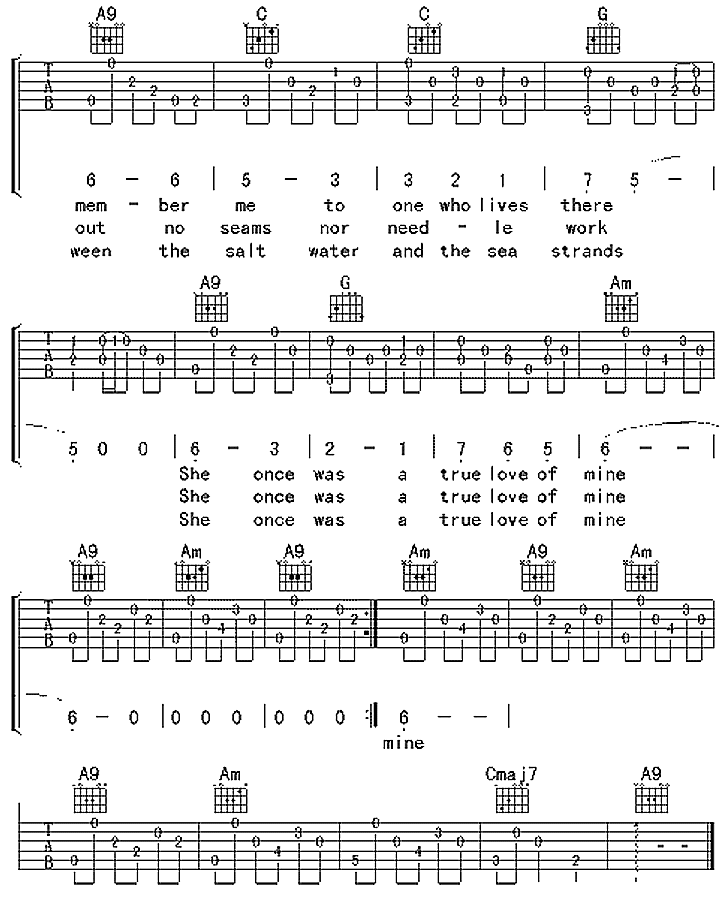

# English Songs

\newpage

## Hotel California

```
(Bm)  On a dark desert highway,    (F#)  cool wind in my hair
      Her mind is Tiffany-twisted,       she got the Mercedes bends
===>  Last thing I remember,             I was running for the door
(A)   Warm smell of colitas                (E) rising up through the air
      She got a lot of pretty pretty boys,     she calls friends
      I had to find the passage back           to the place I was before
(G)   Up ahead in the distance,        (D)  I saw a shimmering light
      How they dance in the courtyard,      sweet summer sweat.
      'Relax,' said the night man,          'We are programmed to receive.
(Em)  My head grew heavy and my sight grew dim, (F#)  I had to stop for the night
      Some dance to remember,                         some dance to forget
      You can check-out any time you like,            But you can never leave!'(End)
(Bm)  There she stood in the doorway;  (F#)  I heard the mission bell
      So I called up the Captain,            'Please bring me my wine'
===>  Mirrors on the ceiling,                The pink champagne on ice
(A)   And I was thinking to myself this could be    (E) heaven or this could be hell
      He said, 'We haven't had that spirit here         since nineteen sixty nine'
      And she said 'We are all just prisoners here,     of our own device'
(G)   Then she lit up a candle,          (D) and she showed me the way
      And still those voices are calling     from far away,
      And in the master's chambers,          They gathered for the feast
(Em)  There were voices down the corridor,   (F#) I thought I heard them say
      Wake you up in the middle of the night,     Just to hear them say...
      They stab it with their steely knives,      But they just can't kill the beast
1/2:(G)Welcome to the (D)Hotel California.
1/2:(F#)Such a lovely place, (Bm)such a lovely face
1:(G)Plenty of room at    (D)the Hotel California
2:(G)They livin' it up at (D)the Hotel California
1:(Em)Any time of year (any time of year)          (F#)you can find it here
2:(Em)What a nice surprise (what a nice surprise), (F#)Bring your alibis
```

\newpage

## Country Roads

Capo: 4

```
G               Em               D                    C         G
Almost Heaven;  West Virginia,   Blue Ridge Mountains,Shenandoah River.
All my memories gather round her,miner's lady,        stranger to blue water.
G                   Em                   D
Life is old there, older than the trees, younger than the mountains,
Dark and dusty,    painted on the sky,   misty taste of moonshine,
  C             G
Blowin like a breeze.
Teardrop in my eye.
[Chorus]
         G              D            Em         C
Country Roads, take me home, to the place, I belong,
         G               D             C             G
West Virginia, mountain mama, take me home, country roads.
[Bridge]
Em           D            G
I hear her voice in the morning hour she calls me,
     C       G              D
The radio reminds me of my home far away.
     Em               F            C
And driving down the road I get a feeling
         G                          D          D7
That I should have been home yesterday, yesterday.
```

\newpage


##  Take me to your heart

Capo: 0 or 2

```
G                                        Em
Hiding from the rain and snow,Trying to forget but I won't let go
Standing on a mountain high,  Looking at the moon through a clear blue sky
C                                D
Looking at a crowded street,     Listening to my own heart beat
I should go and see some friends,But they don't really comprehend
Em                  Bm7     C                G
So many             people  all around the world
Don't need too much talking without saying anything
Em                  Bm7 Am                    D
Tell me where do I find someone like you      girl
All I need is      someone who makes me wanna sing
                G                      Em   C                D
Take me to your heart take me to your soul, Give me your hand before I'm old
                G                      Em   C                D
Show me what love is - haven't got a clue, Show me that wonders can be true
         Bm7            Em      Am          D
They say nothing lasts forever, We're only here today
Bm7            Em     Am            D
Love is now or never, Bring me far away
               G                      Em
Take me to your heart take me to your soul
               C                D
Give me your hand and hold me
                 G        Em
Show me what love is, be my guiding star
        Am    D              G
It's easy, take me to your heart
```

\newpage

## Waiting in the Weeds

Capo: fret 1
```
(G)It's comin' on the (Em)end of August, (G)Another summer's promise (Em)almost gone
(C)And though I heard some wise man say, (G)That every dog will have his day
He never (F)mentioned that these dog days get (Am)so long(D)
(G)I don't know when I realized (Em)the dream(G) was over  
Well, there was no (Em)particular hour, no given day
You know, it (C)didn't go down in flame  
There was no (G)final scene, no frozen frame
(F)I just watched it slowly fade (Am)away (D)
[Chorus]
And (Em)I've been waiting in (G)the weeds  
Waiting for my (Am)time to come (C)around again and
(Em)Hope is floating on the (G)breeze  
Carrying my (Am)soul high up (C)above the ground and
(Em)I've been keepin' to (G)myself  Knowin' 
that the (Am)seasons are (C)slowly changing
(Em)Even though you're with somebody (G)else  
He'll never love you (Am)like I do(C) ==========
(G)I've been biding time with the (Em)crows and sparrows  
(G)While peacocks prance and strut upon (Em)the stage 
If finding (C)love is just a dance  (G)Proximity and chance
You will (F)excuse me if I skip the (Am)masquerade (D)
[Chorus]
And (Em)I've been waiting in (G)the weeds  
Waiting for the (Am)dust to settle down (C)along the
(Em)Back roads running through the (G)fields  
Lying on the (Am)outskirts of this (C)lonesome town
(Em)And I imagine sunlight in your (G)hair, You're at the county (Am)fair
You're holding (C)hands and laughing, (Em)And now the ferris wheel has (G)stopped
You're swinging on the (Bm)top, Suspended (F#)there with him
(G)And he's the darling of the (D)sheik, The flavor of the (Bm)week is (F#)melting
(G)Down your pretty summer (D)dress, Baby, what a (F#)mess you're making
[Solo]
Bm   A#5+    D   A#5+   
(Bm)I've been stumbling through some (A#5+)dark places        
(D)Now I'm following the (A#5+)plow
(Bm)I know I've fallen out of your (A#5+)good graces  
(Am)It's alright (D)now
(Em)And I've been waiting in the (G)weeds  
Waiting for the (Am)summer rain to (C)fall upon the
(Em)Wild birds scattering the (G)seeds  
Answering the (Am)calling of the (C)tide's eternal tune
(Em)The phases of the (G)moon  
The chambers of (Am)the heart
The egg and (C)dart of small gray  
(Em)Spiders spinning in the (G)dark
In spite of all the (Am)times the web is torn (C)apart
And (Em)I've been waiting in the (G)weeds  
Waiting for the (Am)time to come (C)around again and
(Em)Hope is floating on the (G)breeze  
Carrying my (Am)soul high up (C)above the ground and
(Em)I've been keeping to (G)myself  
Knowing that the (Am)seasons are (C)slowly changing
(Em)Even though you're with somebody (G)else  
He'll never love you like I (Am)do~ (G)
Em    G    Am       C      Em
```

\newpage

## The Sound of Silence

```
(Am)Hello darkness, my old (G)friend,
I've come to talk with you (Am)again,
Because a vision (F)softly creeping(C),
Left its seeds while I (F)was sleeping(C),
And the (F)vision that was planted (C)in my brain
Still (Am)remains
(C)Within the (G)sound of (Am)silence.
                        G          Am
In restless dreams I walked alone  Narrow streets of cobblestone,
And in the naked light I saw,      Ten thousand people, maybe more.
                   F        C                                F        C
'neath the halo of a street lamp,  I turned my collar to the cold and damp
People talking without speaking,   People hearing        without listening
        F                                        C
When my eyes were stabbed by the flash of a neon light
People writing songs that voices never share
                 Am    C              G        Am
That split the night,  And touched the sound of silence.
And no one dare,       Disturb the sound of silence.
                         G                             Am
Fools said I, you do not know,   Silence like a cancer grows.
And the people bowed and prayed, To the neon God they made.
                     F           C                      F           C
Hear my words that I might teach you, Take my arms that I might reach you.
And the sign flashed out its warning, In the words that it was forming.
C      F                            C  Am C       G                 Am
But my words like silent raindrops fell, And echoed In the wells of silence
                       F
And the sign said, the words of the prophets
        F                       C                C    Am
Are written on the subway walls And tenement halls.
         C           G         Am
And whisper'd in the sounds of silence.
```

\newpage

## Take it easy(The Eagles)

```
Well I'm a (G)runnin' down the road try'n to loosen my load
I've got seven women (D)on my (C)mind
(G)Four that wanna own me, (D)two that wanna stone me
(C)One says she's a friend of (G)mine
Take it (Em)easy, take it (C)easy(G)
Don't let the (Am)sound of your own (C)wheels drive you (Em)crazy
Lighten (C)up while you still (G)can
Don't even (C)try to (G)understand
Just find a (Am)place to make your (C)stand,  and take it (G)easy

Well, I'm a (G)standin' on a corner in Winslow, Arizona
Such a fine (D)sight to (C)see
It's a (G)girl my lord in a (D)flat-bed Ford
Slowin' (C)down to take a look at me(G)
Come on, (Em)baby(D), don't say (C)maybe(G)
I gotta (Am)know if your (C)sweet love is gonna save me(Em)
We may (C)lose and we (G)may win, but we will (C)never be here again(G)
So open up (Am)I'm climbin' in(C), so take it easy(G)

Solo: G D C, G D C G, Em D C G, Am C Em D
            G
Well, I'm a runnin' down the road tryin' to loosen my load
Got a world of trouble (D)on my mind(C)
(G)Lookin' for a lover who (D)won't blow my cover, she's (C)so hard to (G)find
[Chorus]
Take it (Em)easy,  take it (C)easy(G)
Don't let the (Am)sound of your (C)own wheels make you (Em)crazy
        C G             C  G
Come on baby, don't say maybe
        Am                 C             G       
I gotta know of your sweet love is gonna save me
             G  G7    C                      G  G7    C  
Oh we got it e__e_____asy, We oughta take it e__e_____asy
```

\newpage

## Sunshine In The Rain

Key: C#, Capo: 2
```
Am          Dm7            G                         C                     Am
When I'm in Berlin you're off to London, When I'm in New York you're doing Rome
Wishing we could be more telepathic,     Tired of the nights I sleep       alone
Even if we call the highest power,       We can only do one town a         time 

                Dm7             G                             C
All those crazy nights we spend together,  As voices on the     phone
Wishing we could redirect the traffic,     And find ourselves a home
Words are not enough action speaks louder, Second time          around

                 F                G                         G               C 
Can you feel the raindrops in the desert, Have you seen the sunraise in the dark
               F                 G          G                               Am
Do you feel my love when I'm not present, Standing by your side while miles apart
                Dm7                     G                      C
Sunshine in the rain, Love is still the same, Sunshine in the rain
```

\newpage

## Lying Eyes(The Eagles)

Capo: 3

```
G  Gmaj7 C Am D7 G
[Verse]
G               Gmaj7            C
City girls just seem to find out early, 
Am                            D7
how to open doors with just a smile.
  G                Gmaj7             C
A rich old man and she won't have to worry; 
       Am              C              G
she'll dress up all in lace and go in style.
G               Gmaj7              C
Late at night a big old house gets lonely;
  Am                                 D7
I guess every form of refuge has its price.
G                          Gmaj7             C
And it breaks her heart to think her love is only
      Am            C                G   C D   
Given to a man with hands as cold as ice.
       G                  Gmaj           C
So she tells him she must go out for the evening
    Am                                 D7
To comfort an old friend who's feeling down.
    G                    Gmaj7          C
But he knows where she's goin' as she's leavin';
      Am              C                G
She's headed for that cheatin' side of town.
[Chorus]
          G   C           G              Em   Bm            Am      D
You can't hide your lyin' eyes, and your smile is a thin disguise.
             G  G7         C  A7      Am              D                G
I thought by now you'd realize there ain't no way to hide those lying eyes.
[Verse]
       G                  Gmaj7          C
On the other side of town a boy is waiting
    Am                                 D7
with stormy eyes and dreams no-one could steal
    G                    Gmaj7          C
She drives on throught the night anticipating
       Am                 C               G        C   D
Cos he makes her feel the way she used to feel
       G                  Gmaj           C
She rushes to his arms they fall together
    Am                                 D7
She whispers that its only for a while
    G                    Gmaj7          C
She says that soon she'll be coming back forever
      Am              C                G
She pulls away and leaves him with a smile
[Chorus]
          G   C           G              Em   Bm            Am      D
You can't hide your lyin' eyes, and your smile is a thin disguise.
             G  G7         C  A7      Am              D7                G
I thought by now you'd realize there ain't no way to hide those lying eyes.
[Verse]
    G           Gmaj7           C
She gets up and pours herself a strong one
    Am                                D7
And stares out at the stars up in the sky.
 G                  Gmaj7      C
Another night, it's gonna be a long one;
    Am                  C                 G                
She draws the shade and hangs her head to cry.
    G           Gmaj7           C
And she wonders how it ever got this crazy
    Am                                D7
She thinks about a boy she knew in school
 G                  Gmaj7      C
Did she get tired or did she just get lazy
    Am                  C                 G    
She's so far gone, she feels just like a fool
G              Gmaj7              C
My, oh my, you sure know how to arrange things;
    Am                           D7
You set it up so well, so carefully.
         G              Gmaj7           C 
Ain't it funny how your new life didn't change things;
       Am                 C                G
You're still the same old girl you used to be.
[Chorus]
           G   C           G              Em   Bm            Am      D
You can't hide your lyin' eyes, and your smile is a thin disguise.
             G  G7         C  A7      Am              D                G
I thought by now you'd realize there ain't no way to hide those lying eyes.
```

\newpage

##  Thank You(Dido)

https://tabs.ultimate-guitar.com/tab/dido/thank_you_chords_57890

\newpage

## Chasing Pavements

https://tabs.ultimate-guitar.com/tab/adele/chasing_pavements_chords_989912

```
[Verse]
     C                      G
I've made up my mind, don't need to think it over
       Em                      F
If I'm wrong I am right, don't need to look no further
           Am      Em           C       Em
This ain't lust, I know this is love... But
   C                      G
If I tell the world, I'll never say enough
              Em          
'Cause it was not said to you
           F                            Am      Em
And that's exactly what I need to do if I'd end up with you
[Chorus]
C             Em             Am
Should I give up or should I just keep chasing pavements
Em         F       G       
Even if it leads nowhere?
C                Em         Am           Em
Or would it be a waste even if I knew my place
         F        G       
Should I leave it there?
C             Em             Am
Should I give up or should I just keep chasing pavements
Em         F       G     C
Even if it leads nowhere?
[Verse]
C                     G
I build myself up and fly around in circles
        Em                       F
Waiting as my heart drops and my back begins to tingle
    Am             Em
Finally could this be it? Or..
[Chorus]
C             Em             Am
Should I give up or should I just keep chasing pavements
Em         F       G
Even if it leads nowhere?
C                Em         Am           Em
Or would it be a waste even if I knew my place
         F        G
Should I leave it there?
C             Em             Am
Should I give up or should I just keep chasing pavements
Em         F       G     C
Even if it leads nowhere?
[Bridge]
F                            Em
Should I give up or should I just keep chasing pavements
     Am            Em
Even if it leads nowhere?
            F                    Em
Or would it be a waste even if I knew my place
           Am                    G 
Should I leave it there? Should I give up? 
            C         Em    Am   Em
Or should I just keep on chasing pavements
         C         Em    Am   Em       
Should I just keep on chasing pavements?
[Interlude]
Em F  Or..
[Chorus]
C             Em             Am
Should I give up or should I just keep chasing pavements
Em         F       G
Even if it leads nowhere?
C                Em         Am           Em
Or would it be a waste even if I knew my place
         F        G
Should I leave it there?
C             Em             Am
Should I give up or should I just keep chasing pavements
Em         F       G     C
Even if it leads nowhere?
```

\newpage

## Rolling In The Deep

https://tabs.ultimate-guitar.com/tab/adele/rolling_in_the_deep_chords_1028320

\newpage


## Rhythm of the Rain

```
D                           G
Listen to the rhythm of the falling rain
D                                A
Telling me just what a fool I've been
  D                                G
I wish that it would go and let me cry in vain
    D          A     D   
And let me be alone again
    D                          G
The only girl I care about has gone away
D                       A
Looking for a brand new start
    D            
But little does she know
              G
That when she left that day
D                  A       D      A
Along with her she took my heart
G                            F#m
Rain please tell me now does that seem fair
    G                               D
For her to steal my heart away when she don't care
  Bm                         Em         A          D   A
I can't love another when my hearts somewhere far away
    D                          G
The only girl I care about has gone away
D                       A
Looking for a brand new start
    D            
But little does she know
              G
That when she left that day
 D                 A       D
Along with her she took my heart
D  G  D  A  x2 A
G                              F#m
Rain won't you tell her that I love her so
G                             D
Please ask the sun to set her heart aglow
Bm                            Em      A             D   A
Rain in her heart and let the love we knew start to grow
D                           G
Listen to the rhythm of the falling rain
D                                A
Telling me just what a fool I've been
  D                                G
I wish that it would go and let me cry in vain
    D          A     D   A
And let me be alone again
    D             Bm            D                    Bm  
Oh, listen to the falling rain, Pitter pater, pitter pater  3x
```

\newpage

## Casablanca

https://tabs.ultimate-guitar.com/tab/bertie_higgins/casablanca_chords_1215013

```
Am                                        Dm7 (f e d c)-passing notes
   I fell in love with you watching Casablanca
G (b)-passing note                      Cmaj7/E
   Back row at the drive in show in the flickering light
E                    E7             Am                      Dm7
Popcorn and cokes beneath the stars    became champagne and caviar
G                                     Am-fill  1x
   Making love on a long hot summers night

I thought you fell in love with me watching Casablanca
Holding hands 'neath the paddle fans in Rick's candle lit cafe
Hiding the shadows from the spots, a rocky moonlight in your arms
Making magic in the movies in my old Chevrolet

A7      Dm7              G            Cmaj7/E  A  A7
Oooh, a kiss is still a kiss in Casablanca
    Dm7            G                Cmaj7/E
But kiss is not a kiss without your sigh
 Am                             Dm7 (f e d c)
Please come back to me in Casablanca
  G                                            Am-fill  2x
I love you more and more each day as time goes by

solo  (verse chords)

I guess there're many broken hearts in Casablanca
You know I've never really been there so I don't know
I guess our love story will never be seen on the big wide silver screen
But it hurts just as bad when I had to watch it go

chorus  2x

  Dm7                         G                Am-fill
I love you more and more each day as time goes by

[Outro] Am
```

\newpage

## Hey Jude

Capo: 3

```
       C                 G
(1)hey jude dont make it bad 
(2)hey jude dont be afraid 
(3)hey jude dont let me down 
       G7                   C
take a sad song and make it better 
you were made to go out and get her
you have found her now go and get her
F                             C
remember to let her into your heart
the minute you let her under you skin
remember to let her into your heart
             G7               C
then you can start to make it better 
then you begin to make it better
then you can start to make it better
       C7               F
(1)and anytime you feel the pain
(2)so let it out and let it in
   F         Dm                            G7              C
(1)hey jude, refrain. Dont carry the world upon your shoulders 
(2)hey jude, begin.   Youre waiting for someone to perform with
   C7                            F
(1)For well  you know that its a fool
(2)And don't you know that its just you
   F                   D              G7               C
(1)who plays it cool   by making his world a little     colder
(2)hey jude you'll do  the movement you need is on your shoulder
C7        G       C      G       C          F      C  
na na na  (n)a na na na  (n)a na na na na , (H)ey (J)ude
```

\newpage

## Seasons In The Sun

Capo at 6th or transpose +6 for original,(or leave like this to sing
with baritones!)  Ask if you want chord fingering help.
```
[Intro]  
Eb- E- F- Eb  x2   Eb- E- F- C
[Verse]
                             C                                          Dm
Goodbye to you my trusted friend, we've known each other since we were nine or ten
                                C
together we climbed hills and trees
                   Dm        -       G           -         C
learned of love A B C, skinned our hearts and skinned our knees
                                C                                  Dm
Goodbye my friend it's hard to die, when all the birds are singing in the sky
                               C
now that the spring is in the air
                       Dm   G                          C
pretty girls are evry where, think of me and I'll be there
[Refrain]
        C                        Dm
We had joy, we had fun, we had seasons in the sun,
         G                                            C      Eb- E- F- C
but the hills thet we climb were just seasons out of time
[Verse]
                             C                                Dm
Goodbye papa please pray for me, I was the blacksheep of the family,
                                   C
you tried to teach me right from wrong,
          C       -         Dm      -    G          C
too much wine and too much song, wonder how I got along
                            C                                  Dm
Good bye papa it's hard to die, when all the birds are singing in the sky
                               C
now that the spring is in the air
                      Dm  G                             C
little children everywhere, when you see them I'll be there


[Refrain]

        C                        Dm
We had joy, we had fun, we had seasons in the sun,
          G                                          C
but the wine and the song like the seasons have all gone
        Eb                       Fm
We had joy, we had fun, we had seasons in the sun,
         Bb                                          Eb    Eb- E- F- C
but the wine and the song like the seasons have all gone


[Verse]

                            C                                   Dm
Goodbye Michelle my little one, you gave me love and helped me find the sun,
                           C
and every time that I was down,
     C     -      Dm        -      G                  C
you always come around and get my feet back on the ground,
                               C                                  Dm
Goodbye Michelle it's hard to die, when all the birds are singing in the sky,
                               C
now that the spring is in the air,
                        Dm   G                              C
with the flowers everywhere, I wish that we could both be there


[Refrain]

        C                       Dm
We had joy, we had fun, we had seasons in the sun,
          G                                              C
but the stars we could reach were just starfish on the beach 
        Eb                      Fm
We had joy, we had fun, we had seasons in the sun,
         Bb                                              Eb
but the stars we could reach were just starfish on the beach 
        E                       F#m
We had joy, we had fun, we had seasons in the sun,
          B                                          E 
but the wine and the song like the seasons have all gone
         E                        F#m
All our lives we had fun, we had seasons in the sun,
          B                                             E
but the hills that we climbed were just seasons out of time
```

\newpage

##   Scarborough Fair

Capo: 4

```
Am               G           Am    C         Am       C D      Am
Are you going to Scarborough Fair, Parsley sage rosemary and thyme
  Am     C     C   G/B Am    G      Am       G                  Am
Remember me to one who lives there, She Once was a true love of mine

Am                    G       Am     C         Am       C D      Am
Tell her to make me a cambric shirt, Parsley sage rosemary and thyme
    Am     C         C   G/B Am G     Am          G               Am
Without no seams nor nee-ee-dle work, Then she'll be a true love of mine
Am                     G       Am    C         Am       C D      Am
Tell her to find me an acre of land, Parsley sage rosemary and thyme
   Am            C     C   G/B Am  G        Am          G                 Am 
Between the salt water and the sea strands, Then she'll be a true love of mine
Am                         G         Am       C         Am       C D      Am
Tell her to reap it with a sickle of leather, Parsley sage rosemary and thyme
    Am        C        C G/B Am G        Am          G                 Am
And gather it all in a bunch of heather, Then she'll be a true love of mine
Am               G           Am    C         Am       C D      Am
Are you going to Scarborough Fair, Parsley sage rosemary and thyme
  Am     C     C   G/B Am    G      Am       G                  Am
Remember me to one who lives there, She Once was a true love of mine
```

<iframe width="560" height="315" src="https://www.youtube.com/embed/5JhPbKg20Gc" frameborder="0" allow="autoplay; encrypted-media" allowfullscreen></iframe>


<iframe width="560" height="315" src="https://www.youtube.com/embed/vfivZFK0cm4" frameborder="0" allow="autoplay; encrypted-media" allowfullscreen></iframe>


<iframe width="560" height="315" src="https://www.youtube.com/embed/aeB_InOR_RA" frameborder="0" allow="autoplay; encrypted-media" allowfullscreen></iframe>




\newpage

## Betrayal

```
Am                 C     G                    Am
My love has gone away, quietly after hundred days
(Em)This is what's she has (F)always said she won't (G)stay
for more than what she can (Am)repay

(Am)I can still hear her (C)say (G)that I'm not hearing tender (Am)play
(Em)The day she let me (F)kiss her was a (G)display
of love to those who she (Am)betray

(Am)How can I put (C)someone to the test, when I thought (G)I got the best?
Until the (Am)taste of bitterness then I (Em)regret
but still I won't (F)detest
The love I can't (G)forget, like someone who has (Am)left

(Am)How can I leave someone for the (C)rest when I'm (G)facing the best?
Until the (Am)taste of treachery then I (Em)regret
But still I won't (F)detest
who I can never (G)forget like someone I once (Am)met
```


<iframe width="560" height="315" src="https://www.youtube.com/embed/6ZtUhehAL8g" frameborder="0" allow="autoplay; encrypted-media" allowfullscreen></iframe>

  
  


\newpage

## Summer Kisses, Winter Tears

```
Summer Kisses, Winter Tears
Summer kisses, Winter tears
That was what she gave to me
Never thought that I'd travel all alone
The trail of memories

Happy hours, lonely years
But I guess I can't complain
For I still recall the Summer sun
Through all the Winter rain

The fire of love, the fire of love
Can burn from afar
And nothing can light the dark of the night
Like a falling star
Summer kisses, Winter tears
Like the stars they fade away
Leaving me to spend my lonely nights
With dreams of yesterday

The fire of love, the fire of love
Can burn from afar
And nothing can light the dark of the night
Like a falling star
Summer kisses, Winter tears
Like the stars they fade away
Leaving me to spend my lonely nights
With dreams of yesterday

Leaving me to spend my lonely nights
With dreams of yesterday
Summer kisses, Winter tears
```

Capo 3

<iframe width="560" height="315" src="https://www.youtube.com/embed/-52WsmdLq-0" frameborder="0" allow="autoplay; encrypted-media" allowfullscreen></iframe>


<iframe width="560" height="315" src="https://www.youtube.com/embed/_ZTgr0w-Lhg" frameborder="0" allow="autoplay; encrypted-media" allowfullscreen></iframe>

  
  
  
  
