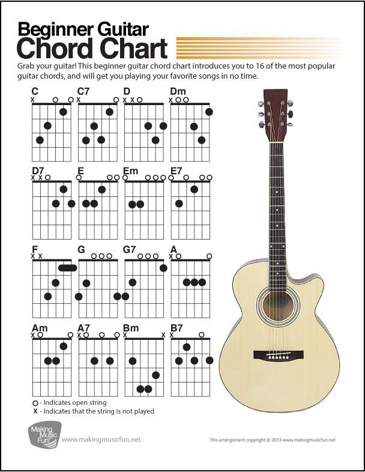

# Preface

~~~~

> **<<码农乐谱>>收集了100首华语和英文经典好歌,乃码农朋友居家旅行,休闲娱乐,陶冶情操之良友!**  


  
收集整理: Henry Fuheng Wu   
微信: verypureman  
Email : i@quant365.com  
Wechat QR Code:  
  
<hr>

><br>
<a href=http://paypal.me/Quant365> 欢迎打赏并下载PDF版本 </a>
<form action="https://www.paypal.com/cgi-bin/webscr" method="post" target="_top">
<input type="hidden" name="cmd" value="_s-xclick">
<input type="hidden" name="encrypted" value="-----BEGIN PKCS7-----MIIHLwYJKoZIhvcNAQcEoIIHIDCCBxwCAQExggEwMIIBLAIBADCBlDCBjjELMAkGA1UEBhMCVVMxCzAJBgNVBAgTAkNBMRYwFAYDVQQHEw1Nb3VudGFpbiBWaWV3MRQwEgYDVQQKEwtQYXlQYWwgSW5jLjETMBEGA1UECxQKbGl2ZV9jZXJ0czERMA8GA1UEAxQIbGl2ZV9hcGkxHDAaBgkqhkiG9w0BCQEWDXJlQHBheXBhbC5jb20CAQAwDQYJKoZIhvcNAQEBBQAEgYArgZrKJXUWjrWfUohx+kOjkePo6iVocoHcqwU4ladeqkec1c0ec2qIGIaRj8NxYo7fGJZQRM7YCZBVn3od0vf4eDHcb5iOSJlrO46afnuiNXBNrhNflJi6tGhP+wP8VTbtDsFiiSw7IPF/oBSBqnSbXytQPfqTDJQA+YuxkVfDlTELMAkGBSsOAwIaBQAwgawGCSqGSIb3DQEHATAUBggqhkiG9w0DBwQIdDjJOxtKY0aAgYgwbSV7ib4Fq6sXvB1DlrLU26IYBIMa8gML+OONylJuuCIdQGggAoRxlr71WrR+TOraZlxPAeRPky/CJcQUaCPZSx2p3et1Qw5wpou43MOCN9en34oXF1GM4LtLgNcljp85sPj7EU1lTz6o6PdH42LSuQTu3o3HAowp7jLpXs7tFkfqm86KB9/soIIDhzCCA4MwggLsoAMCAQICAQAwDQYJKoZIhvcNAQEFBQAwgY4xCzAJBgNVBAYTAlVTMQswCQYDVQQIEwJDQTEWMBQGA1UEBxMNTW91bnRhaW4gVmlldzEUMBIGA1UEChMLUGF5UGFsIEluYy4xEzARBgNVBAsUCmxpdmVfY2VydHMxETAPBgNVBAMUCGxpdmVfYXBpMRwwGgYJKoZIhvcNAQkBFg1yZUBwYXlwYWwuY29tMB4XDTA0MDIxMzEwMTMxNVoXDTM1MDIxMzEwMTMxNVowgY4xCzAJBgNVBAYTAlVTMQswCQYDVQQIEwJDQTEWMBQGA1UEBxMNTW91bnRhaW4gVmlldzEUMBIGA1UEChMLUGF5UGFsIEluYy4xEzARBgNVBAsUCmxpdmVfY2VydHMxETAPBgNVBAMUCGxpdmVfYXBpMRwwGgYJKoZIhvcNAQkBFg1yZUBwYXlwYWwuY29tMIGfMA0GCSqGSIb3DQEBAQUAA4GNADCBiQKBgQDBR07d/ETMS1ycjtkpkvjXZe9k+6CieLuLsPumsJ7QC1odNz3sJiCbs2wC0nLE0uLGaEtXynIgRqIddYCHx88pb5HTXv4SZeuv0Rqq4+axW9PLAAATU8w04qqjaSXgbGLP3NmohqM6bV9kZZwZLR/klDaQGo1u9uDb9lr4Yn+rBQIDAQABo4HuMIHrMB0GA1UdDgQWBBSWn3y7xm8XvVk/UtcKG+wQ1mSUazCBuwYDVR0jBIGzMIGwgBSWn3y7xm8XvVk/UtcKG+wQ1mSUa6GBlKSBkTCBjjELMAkGA1UEBhMCVVMxCzAJBgNVBAgTAkNBMRYwFAYDVQQHEw1Nb3VudGFpbiBWaWV3MRQwEgYDVQQKEwtQYXlQYWwgSW5jLjETMBEGA1UECxQKbGl2ZV9jZXJ0czERMA8GA1UEAxQIbGl2ZV9hcGkxHDAaBgkqhkiG9w0BCQEWDXJlQHBheXBhbC5jb22CAQAwDAYDVR0TBAUwAwEB/zANBgkqhkiG9w0BAQUFAAOBgQCBXzpWmoBa5e9fo6ujionW1hUhPkOBakTr3YCDjbYfvJEiv/2P+IobhOGJr85+XHhN0v4gUkEDI8r2/rNk1m0GA8HKddvTjyGw/XqXa+LSTlDYkqI8OwR8GEYj4efEtcRpRYBxV8KxAW93YDWzFGvruKnnLbDAF6VR5w/cCMn5hzGCAZowggGWAgEBMIGUMIGOMQswCQYDVQQGEwJVUzELMAkGA1UECBMCQ0ExFjAUBgNVBAcTDU1vdW50YWluIFZpZXcxFDASBgNVBAoTC1BheVBhbCBJbmMuMRMwEQYDVQQLFApsaXZlX2NlcnRzMREwDwYDVQQDFAhsaXZlX2FwaTEcMBoGCSqGSIb3DQEJARYNcmVAcGF5cGFsLmNvbQIBADAJBgUrDgMCGgUAoF0wGAYJKoZIhvcNAQkDMQsGCSqGSIb3DQEHATAcBgkqhkiG9w0BCQUxDxcNMTYwODIwMTMzMzM1WjAjBgkqhkiG9w0BCQQxFgQU3YByLnpAexcFsfSbjNOuarw+cv8wDQYJKoZIhvcNAQEBBQAEgYCdTJ1Z7KwJ5HiUJnppmRk0hxo16e1H/ys90jDMzxHdLL5FHlMNQ/FbeTJqoDOCGMPq05GIYWJ7Tlug6uIBSPHSNyJ1/qCQ/hzuBxcgBn/U+/f2vVDgRcuT1JDaFBvY1DJL5x3jCSQJsklbzrkhqZa2Y9bnWxinSUEUZm8FHSMPHA==-----END PKCS7-----
">
<input type="image" src="https://www.paypalobjects.com/en_US/i/btn/btn_donateCC_LG.gif" border="0" name="submit" alt="PayPal - The safer, easier way to pay online!">

</form>
</center>


~~~~

- Design your own guitar with computer science algorithm

Guitar is a six-string instrument with more than 1000 history. It designed as 6 string because of human hand's physical structure. A human hand has an average size (measured from the tip of the middle finger to the wrist) of 7.44 inches(btw, Trump's measures 7.25 inches.), so the fret cannot be too wide or too narrow. Also echo hand has 5 fingers, so we can use one hand to press at most four strings and to strum with the other hand So let's define the string number to 6:

```python
STRING_NUMBER=6
```

According to music theory, there are seven letters of alphabet called keys to represent notes. Here we use `A0` to represent the first A key from the left of piano keyboard. So we define `note` class as below:

```python
KEYS = ['A','B','C','D','E','F','G']
INTERVALS = [0,2,3,5,7,8,10]
OCTECT_INTERVAL_RANGE = INTERVALS[-1] + 2  # 12
KEYS2INTERVALS = dict(zip(KEYS, INTERVALS))

class note(object):
    def __init__(self, key_, cat):
        self.cat = cat  # middle
        self.key = key_ + str(cat)
        self.fkey = key_ + str(cat)
        self.value = self.cat*OCTECT_INTERVAL_RANGE +  KEYS2INTERVALS[key_]
    def __repr__(self):
        return '{}({})'.format(self.fkey, self.value)
```

```
val2key = {}
key2val = {}
OCTECT_NUMBER=10
for c in range(OCTECT_NUMBER):
    for n in KEYS:
        nt = note(n,c)
        val2key[nt.value] = nt.fkey
        key2val[nt.fkey] = nt.value
```

2**9 * 110 = 56320 Hz


## Common Chords



## All Chords


