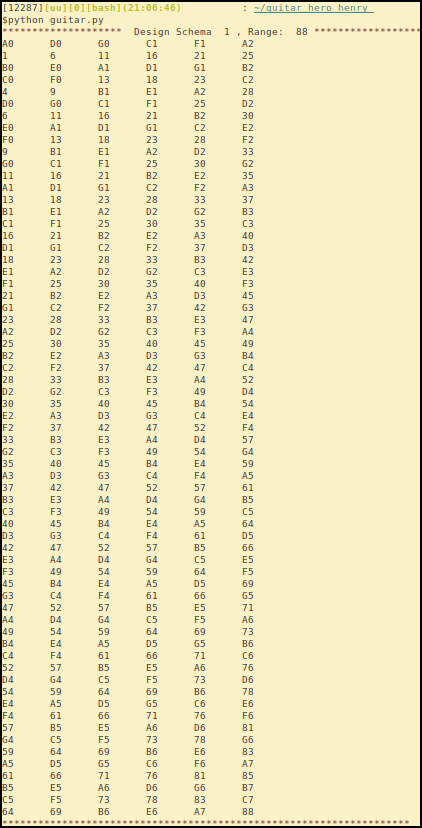

# Preface

~~~~

> **码农乐谱**收集了100+首华语和英文经典好歌,乃码农朋友居家旅行,休闲娱乐,陶冶情操之良友!  


  
收集整理: Henry Fuheng Wu   
微信: verypureman  
Email : i@quant365.com  
Wechat QR Code:  
  
<hr>

> <br>
<a href=http://paypal.me/Quant365> 欢迎打赏并下载PDF版本 </a>
<form action="https://www.paypal.com/cgi-bin/webscr" method="post" target="_top">
<input type="hidden" name="cmd" value="_s-xclick">
<input type="hidden" name="encrypted" value="-----BEGIN PKCS7-----MIIHLwYJKoZIhvcNAQcEoIIHIDCCBxwCAQExggEwMIIBLAIBADCBlDCBjjELMAkGA1UEBhMCVVMxCzAJBgNVBAgTAkNBMRYwFAYDVQQHEw1Nb3VudGFpbiBWaWV3MRQwEgYDVQQKEwtQYXlQYWwgSW5jLjETMBEGA1UECxQKbGl2ZV9jZXJ0czERMA8GA1UEAxQIbGl2ZV9hcGkxHDAaBgkqhkiG9w0BCQEWDXJlQHBheXBhbC5jb20CAQAwDQYJKoZIhvcNAQEBBQAEgYArgZrKJXUWjrWfUohx+kOjkePo6iVocoHcqwU4ladeqkec1c0ec2qIGIaRj8NxYo7fGJZQRM7YCZBVn3od0vf4eDHcb5iOSJlrO46afnuiNXBNrhNflJi6tGhP+wP8VTbtDsFiiSw7IPF/oBSBqnSbXytQPfqTDJQA+YuxkVfDlTELMAkGBSsOAwIaBQAwgawGCSqGSIb3DQEHATAUBggqhkiG9w0DBwQIdDjJOxtKY0aAgYgwbSV7ib4Fq6sXvB1DlrLU26IYBIMa8gML+OONylJuuCIdQGggAoRxlr71WrR+TOraZlxPAeRPky/CJcQUaCPZSx2p3et1Qw5wpou43MOCN9en34oXF1GM4LtLgNcljp85sPj7EU1lTz6o6PdH42LSuQTu3o3HAowp7jLpXs7tFkfqm86KB9/soIIDhzCCA4MwggLsoAMCAQICAQAwDQYJKoZIhvcNAQEFBQAwgY4xCzAJBgNVBAYTAlVTMQswCQYDVQQIEwJDQTEWMBQGA1UEBxMNTW91bnRhaW4gVmlldzEUMBIGA1UEChMLUGF5UGFsIEluYy4xEzARBgNVBAsUCmxpdmVfY2VydHMxETAPBgNVBAMUCGxpdmVfYXBpMRwwGgYJKoZIhvcNAQkBFg1yZUBwYXlwYWwuY29tMB4XDTA0MDIxMzEwMTMxNVoXDTM1MDIxMzEwMTMxNVowgY4xCzAJBgNVBAYTAlVTMQswCQYDVQQIEwJDQTEWMBQGA1UEBxMNTW91bnRhaW4gVmlldzEUMBIGA1UEChMLUGF5UGFsIEluYy4xEzARBgNVBAsUCmxpdmVfY2VydHMxETAPBgNVBAMUCGxpdmVfYXBpMRwwGgYJKoZIhvcNAQkBFg1yZUBwYXlwYWwuY29tMIGfMA0GCSqGSIb3DQEBAQUAA4GNADCBiQKBgQDBR07d/ETMS1ycjtkpkvjXZe9k+6CieLuLsPumsJ7QC1odNz3sJiCbs2wC0nLE0uLGaEtXynIgRqIddYCHx88pb5HTXv4SZeuv0Rqq4+axW9PLAAATU8w04qqjaSXgbGLP3NmohqM6bV9kZZwZLR/klDaQGo1u9uDb9lr4Yn+rBQIDAQABo4HuMIHrMB0GA1UdDgQWBBSWn3y7xm8XvVk/UtcKG+wQ1mSUazCBuwYDVR0jBIGzMIGwgBSWn3y7xm8XvVk/UtcKG+wQ1mSUa6GBlKSBkTCBjjELMAkGA1UEBhMCVVMxCzAJBgNVBAgTAkNBMRYwFAYDVQQHEw1Nb3VudGFpbiBWaWV3MRQwEgYDVQQKEwtQYXlQYWwgSW5jLjETMBEGA1UECxQKbGl2ZV9jZXJ0czERMA8GA1UEAxQIbGl2ZV9hcGkxHDAaBgkqhkiG9w0BCQEWDXJlQHBheXBhbC5jb22CAQAwDAYDVR0TBAUwAwEB/zANBgkqhkiG9w0BAQUFAAOBgQCBXzpWmoBa5e9fo6ujionW1hUhPkOBakTr3YCDjbYfvJEiv/2P+IobhOGJr85+XHhN0v4gUkEDI8r2/rNk1m0GA8HKddvTjyGw/XqXa+LSTlDYkqI8OwR8GEYj4efEtcRpRYBxV8KxAW93YDWzFGvruKnnLbDAF6VR5w/cCMn5hzGCAZowggGWAgEBMIGUMIGOMQswCQYDVQQGEwJVUzELMAkGA1UECBMCQ0ExFjAUBgNVBAcTDU1vdW50YWluIFZpZXcxFDASBgNVBAoTC1BheVBhbCBJbmMuMRMwEQYDVQQLFApsaXZlX2NlcnRzMREwDwYDVQQDFAhsaXZlX2FwaTEcMBoGCSqGSIb3DQEJARYNcmVAcGF5cGFsLmNvbQIBADAJBgUrDgMCGgUAoF0wGAYJKoZIhvcNAQkDMQsGCSqGSIb3DQEHATAcBgkqhkiG9w0BCQUxDxcNMTYwODIwMTMzMzM1WjAjBgkqhkiG9w0BCQQxFgQU3YByLnpAexcFsfSbjNOuarw+cv8wDQYJKoZIhvcNAQEBBQAEgYCdTJ1Z7KwJ5HiUJnppmRk0hxo16e1H/ys90jDMzxHdLL5FHlMNQ/FbeTJqoDOCGMPq05GIYWJ7Tlug6uIBSPHSNyJ1/qCQ/hzuBxcgBn/U+/f2vVDgRcuT1JDaFBvY1DJL5x3jCSQJsklbzrkhqZa2Y9bnWxinSUEUZm8FHSMPHA==-----END PKCS7-----
">
<input type="image" src="https://www.paypalobjects.com/en_US/i/btn/btn_donateCC_LG.gif" border="0" name="submit" alt="PayPal - The safer, easier way to pay online!">

</form>
</center>


~~~~

## Design your own guitar with computer science algorithm

Ref: https://www.linkedin.com/pulse/design-your-own-guitar-computer-science-algorithm-python-henry-wu/

Guitar is a six-string instrument with more than 1000 years history. It is one of the three greatest instruments(the other two are piano and violin). Its strength is the versatility to generate various different beautiful tones which piano and violin couldn't. But its note range is too narrow compared with piano. Often you feel impossible to play guitar with piano scores as the piano has a much wider range overflowing that of guitar. This article is to design guitar to expand its note range but make it easy to play as always.

Guitar was designed as six-string because of human hand’s physical structure. A human hand has an average size (measured from the tip of the middle finger to the wrist) of 7.44 inches(for instance, Trump’s measures 7.25 inches), so the fret cannot be too wide or too narrow. Also each hand has 5 fingers, so we can use one hand to press at most four strings and to strum with the other hand. So let’s define the string number to 6 and fret number as 13:

```python
STRING_NUMBER=6
FRET_NUMBER=13
```

According to music theory, there are seven letters of alphabet called keys to represent notes. Here we use `A0` to represent the first `A` key from the left of piano keyboard. With [12 equal temperament](https://en.wikipedia.org/wiki/Equal_temperament), one octet has 12 tone. So we define `note` class as below:

```python
KEYS = ['A','B','C','D','E','F','G']
VALUES = [0,2,3,5,7,8,10]
OCTET_RANGE = VALUES[-1] + 2  # 12
BASE_KEYS2VALUES = dict(zip(KEYS, VALUES))

class note(object):
    def __init__(self, key_, cat):
        self.cat = cat  # which octect?
        self.key = key_ + str(cat)
        self.fkey = key_ + str(cat)
        self.value = self.cat*OCTET_RANGE +  BASE_KEYS2VALUES[key_]
    def __repr__(self):
        return '{}({})'.format(self.fkey, self.value)
```

We also need to define some mapping between absolute pitch value t key's full name, which I define it as key name plus octect number. Say `C2` means middle `C` in piano and  `C3` is the key which a tenor should reach in my university chorus. Here we define OCTET_NUMBER as 10, which is so crazy number that the frequency could be 56320 Hz for `A9`(2**9 * 110Hz). No animal can sing that high, so I think our map should cover all cases.

```
val2key = {}
key2val = {}
OCTECT_NUMBER=10
for c in range(OCTET_NUMBER):
    for n in KEYS:
        nt = note(n,c)
        val2key[nt.value] = nt.fkey
        key2val[nt.fkey] = nt.value
```

The I define a class `algorithmic_guitar_designer`. It need a base note to construct. A base note is the lowest note in the first octect a guitar can perform. I set it by default as 'E0'. You can explictly specify to `A0` or ther value if you want. Our design goal is to make guitar easiler to play. So all strings should start from some standard key, and adjacent strings's interval are between 4 to 6 tones, and it should have standard keys aligned at more fret as possible as it can.

```
class algorithmic_guitar_designer(object):
    def __init__(self, base_note='E'):
        self.base_line_offset = BASE_KEYS2VALUES[base_note]
    def _create_guitar(self, string_number=STRING_NUMBER, interval = [5, 5, 5, 4, 5]):
        guitar = [[i+self.base_line_offset for i in range(FRET_NUMBER)]]  # base line
        for it in interval:
            new_string = [x+it for x in guitar[-1]]
            guitar.append(new_string)
        return guitar
    def _generate_intervals(self):
        VALUES = []
        interval = [0]*5
        i = 0
        def dfs(VALUES, interval, i):
            if i==5:
                VALUES.append(list(interval))
                return
            for k in [4,5,6]:
                interval[i] = k
                dfs(VALUES, interval, i+1)
        dfs(VALUES, interval, i)
        return VALUES
    def _optimize_guitar_design(self):
        max_tot = [[]]
        res = [[]]
        VALUES = self._generate_intervals()
        for interval in VALUES:
            guitar = self._create_guitar(interval=interval)
            tot = []
            for k in range(len(guitar[0])):
                full = True
                for j in range(STRING_NUMBER):
                    i = guitar[j][k]
                    s = val2key[i] if i in val2key else str(i)#,'\t',
                    if not s[0].isalpha():
                        full = False
                if full:
                    tot.append(k)
            if len(max_tot[0]) < len(tot):
                max_tot = [tot]
                res = [interval]
            elif len(max_tot[0]) == len(tot):
                max_tot.append(tot)
                res.append(interval)
        return res
    def work(self):
        res = self._optimize_guitar_design()
        schema_num = 1
        for r in res:
            print "*"*40, " Design Schema ", schema_num, "*"*40
            guitar = self._create_guitar(interval=r)
            for k in range(len(guitar[0])):
                for j in range(STRING_NUMBER):
                    i = guitar[j][k]
                    s = val2key[i] if i in val2key else str(i)
                    print s, '\t',
                print ""
            print "*"*98
            schema_num += 1
```

And run this program with this driver code:

```
henry = algorithmic_guitar_designer()
henry.work()
```

I get two optimal designs:


The first design schema matches the 1000-year old guitar convention. It means our algorithm is on the right track, and also means the conventional way can be proved theoretically. However, it is not the only optimal way. The second schema looks great too. I believe for some songs, it could be better to perform with the second schema.

As mentioned above, you can replace base key `E0` with other note, for example `A0`, and get different optimal schema. This is the result I got with 13 frets. And you can see the lowest key exapnds from `E0` to `A0`:


To have the same range with a 88-key piano, with six strings, you have to add more frets. I checked when fret number is 65, the range can be 88 keys, which is kind of crazy. We may need to add more strings then.



All in all, with this algorithm, we can effectively expand the range of a guitar can play and make it a more expressive instrument.


## Common Chords


## All Chords


